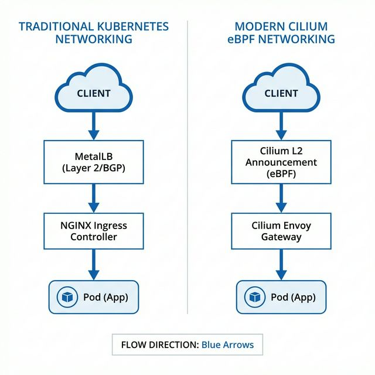
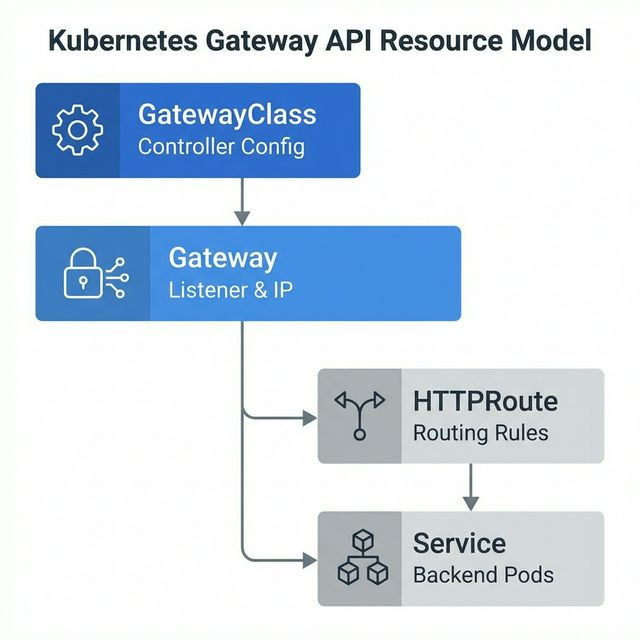

## 1. 痛点：传统本地 K8s 暴露服务的“三剑客”困境

在云上环境（如阿里云、AWS），当我们创建一个 `LoadBalancer` 类型的 Service 时，云服务商会自动为我们分配一个公网 IP。但在本地物理机或虚拟机（Bare Metal）环境中，K8s 原生并不具备分配外部 IP 的能力。

为了让外部网络访问集群内部应用，我们通常需要组装一整套“全家桶”：
1. **Calico 或 Flannel**：提供集群内部 Pod 通信的 CNI（基于 iptables/IPVS，存在一定的性能损耗）。
2. **MetalLB**：为 LoadBalancer Service 分配本地局域网 IP，并通过 ARP/BGP 宣告出去。
3. **NGINX Ingress Controller**：提供七层（HTTP/HTTPS）的域名路由能力。

**传统架构的心智负担与性能瓶颈：**
组件繁多，排错链路长：`外部请求 -> MetalLB IP -> NodePort -> NGINX Ingress Pod -> iptables转发 -> 业务 Pod`。
随着微服务规模扩大，基于 iptables 的转发规则会呈指数级增长，消耗大量 CPU。

## 2. 破局：Cilium 大一统与 Gateway API 的降维打击

随着 **eBPF** 技术的成熟和 **Gateway API**（K8s 原生下一代网关标准）的普及，**Cilium 彻底重写了游戏规则**。

从 Cilium 1.13+ 开始，它原生集成了 L2 Announcement（二层宣告）功能；从 1.14+ 开始，原生完全支持了 Gateway API。
这意味着，**你只需要安装一个 Cilium 组件，就可以同时无缝替换掉 Calico、MetalLB、Kube-Proxy 和 Nginx Ingress！**

### 架构大对比图
仔细体会这两种架构的极简度对比：



*图：通过 eBPF 技术，Cilium 可以绕过内核传统的复杂协议栈匹配，直接在底层抓取流量飞速送达目标 Pod，实现了极致的性能优化，同时砍掉了 Nginx Ingress 所需的额外跳转。*

---

## 3. 核心原理：它是如何运作的？

### 3.1 Cilium L2 Announcement（本地负载均衡）
Cilium 的 L2 宣告原理与 MetalLB 二层模式非常相似，但它是原生的：
当我们在集群中定义了一个分配给 Gateway 的局域网 IP 时，Cilium Agent 会监听局域网的 ARP（IPv4）或 NDP（IPv6）请求。当家里的路由器/交换机在网内大喊“谁拥有这个 IP ？”时，Cilium 原生代为回应该 Node 的 MAC 地址，从而将发往该网关 IP 的真实流量，精准地吸附到健康的 Kubernetes Node 上。

### 3.2 Gateway API 资源模型与解耦
与传统 NGINX 只有一个巨大的 `Ingress` 配置大乱烩不同，Gateway API 进行了清晰的职责角色解耦，让运维和研发各司其职：



- **GatewayClass**：定义网关所属的“品牌”和控制器（这里是 Cilium）。
- **Gateway**：声明网关具体的监听端口（如 80, 443）和绑定的 IP 池。
- **HTTPRoute**：真正定义应用的路由规则（比如根据不同路径/域名打到哪些微服务）。

---

## 4. 实战：在本地集群部署 Cilium Gateway 与 L2

接下来，我们将在没有任何 LoadBalancer 支撑的本地测试或生产集群中，用 Cilium 从零接管网络！

### Step 1: 环境准备 & 部署 Gateway API 标准 CRD
> ⚠️ **先决条件**：确保你的 Kubernetes 在装机时（kubeadm init / k3s args）关闭了默认的 CNI 插件和 Kube-Proxy。如果集群存在被替换的老组件（MetalLB等），请提前排空并卸载。

在安装 Cilium 之前，**必须** 先向集群注册原生 Gateway API 的 CRD 定义库：
```bash
kubectl apply -f https://raw.githubusercontent.com/kubernetes-sigs/gateway-api/v1.0.0/config/crd/standard/gateway.networking.k8s.io_gatewayclasses.yaml
kubectl apply -f https://raw.githubusercontent.com/kubernetes-sigs/gateway-api/v1.0.0/config/crd/standard/gateway.networking.k8s.io_gateways.yaml
kubectl apply -f https://raw.githubusercontent.com/kubernetes-sigs/gateway-api/v1.0.0/config/crd/standard/gateway.networking.k8s.io_httproutes.yaml
```

### Step 2: 魔法开启 - 安装配置 Cilium
使用 Helm 安装 Cilium 并使用下面的关键参数开启相关黑科技火力：

```bash
helm repo add cilium https://helm.cilium.io/

helm install cilium cilium/cilium \
  --namespace kube-system \
  --set kubeProxyReplacement=true \
  --set l2announcements.enabled=true \
  --set externalIPs.l2announcements.enabled=true \
  --set devices=eth0 \
  --set gatewayAPI.enabled=true
```
*(注意：`devices=eth0` 中的 `eth0` 请通过 `ip a` 命令确认替换为你服务器响应外网的真实网卡名称)*

### Step 3: 配置 IP 池与二层宣告网段
Cilium 需要知道它可以向家里/机房局域网广播申请哪些 IP 端。假设你的局域网网段是 `192.168.1.0/24`，你可以划拨 `.200` 到 `.240` 让 K8s 自由使用。

编写 `ip-pool.yaml`，声明地盘：
```yaml
apiVersion: "cilium.io/v2alpha1"
kind: CiliumLoadBalancerIPPool
metadata:
  name: "lan-pool"
spec:
  cidrs:
  - cidr: "192.168.1.200/29" # 提供大约6个可用IP，供不同业务网关使用
```

编写 `l2-policy.yaml`，告诉局域网谁有权利去回应 ARP 广播包（通常选择所有节点或指定的入口节点）：
```yaml
apiVersion: "cilium.io/v2alpha1"
kind: CiliumL2AnnouncementPolicy
metadata:
  name: default-l2-policy
spec:
  interfaces:
  - "^eth[0-9]+" # 指定监听 ARP 响应的网卡正则匹配
  nodeSelector:
    matchExpressions:
      - key: node-role.kubernetes.io/control-plane
        operator: DoesNotExist  # 推荐将 Worker 的流量单独剥离
```

执行部署应用：
```bash
kubectl apply -f ip-pool.yaml
kubectl apply -f l2-policy.yaml
```

### Step 4: 极简声明，创建 Gateway 实例
网络底层基建好了，以后网推只需一行。建立一个 HTTP Gateway，Cilium 会自动为它分配一个来自 `lan-pool` 里的 IP 用于访问。

编写 `gateway.yaml`：
```yaml
apiVersion: gateway.networking.k8s.io/v1
kind: Gateway
metadata:
  name: my-cilium-gateway
  namespace: default
spec:
  gatewayClassName: cilium # 引用刚才安装参数自动生成的内设 Class
  listeners:
  - name: web
    protocol: HTTP
    port: 80
    allowedRoutes:
      namespaces:
        from: All
```
执行 `kubectl apply -f gateway.yaml`，激动人心的时刻来了，查询分配信息：
```bash
kubectl get gateway
# 输出效果示例：
# NAME                CLASS    ADDRESS         PROGRAMMED   AGE
# my-cilium-gateway   cilium   192.168.1.200   True         1m
```
看到了吗！此时你的 K8s 终于有了一个能在物理内网被路由器承认的 IP `192.168.1.200`！

### Step 5: 部署业务并用 HTTPRoute 路由它

网关已就绪！我们部署一个 whoami 探针应用进行测试，并将自定义域名导向它。

部署资源 `app-route.yaml`：
```yaml
---
apiVersion: apps/v1
kind: Deployment
metadata:
  name: whoami
spec:
  replicas: 2
  selector:
    matchLabels:
      app: whoami
  template:
    metadata:
      labels:
        app: whoami
    spec:
      containers:
      - name: whoami
        image: traefik/whoami
        ports:
        - containerPort: 80
---
apiVersion: v1
kind: Service
metadata:
  name: whoami-service
spec:
  selector:
    app: whoami
  ports:
  - port: 80
    targetPort: 80
---
# 现代范儿！替代 Ingress 的 HTTPRoute 配置
apiVersion: gateway.networking.k8s.io/v1
kind: HTTPRoute
metadata:
  name: whoami-route
spec:
  parentRefs:
  - name: my-cilium-gateway # 就是刚才那个拿到了192.168.1.200 IP 的网关
  hostnames:
  - "whoami.local"          # 你的测试虚拟域名
  rules:
  - matches:
    - path:
        type: PathPrefix
        value: /
    backendRefs:
    - name: whoami-service
      port: 80
```
执行部署：`kubectl apply -f app-route.yaml`。

---

## 5. 见证奇迹：连通测试

在你的个人笔记本电脑/开发机上，将测试域名通过 Hosts 文件强制解析到 Cilium 给出的 Gateway IP：
> **Windows**: `C:\Windows\System32\drivers\etc\hosts`
> **Mac/Linux**: `/etc/hosts`

追加一行：
```text
192.168.1.200 whoami.local
```

打开浏览器或者直接使用命令行请求：
```bash
curl http://whoami.local
```
**如果成功返回类似下方带有 Pod IP 的诊断信息，恭喜你成功了！**
```text
Hostname: whoami-54dc5978f8-8q2tz
IP: 10.0.1.52
IP: fe80::ecc4:90ff:fed7:5546
RemoteAddr: 10.0.1.189:48324
GET / HTTP/1.1
Host: whoami.local
User-Agent: curl/7.81.0
```
你成功跑通了这条极速公路： **外部 -> 本机局域网 ARP -> Cilium Envoy 网关 -> eBPF 高速公路 -> 业务 Pod**，完成闭环！

## 6. 终极总结 🚀 

由于复杂的历史包袱，Kubernetes 裸机环境长期以来只能靠各种开源方案（如 MetalLB + Ingress Nginx）拼凑堆砌。尽管有效，却极其臃肿。

当云原生进入深水区：
- **Gateway API** 作为下一代标准，在逻辑控制面上优雅统一了流量入口管理，淘汰了能力有限的 Ingress 资源。
- **Cilium eBPF** 在网络数据面上成为最高效的转发底座，真正实现了跨维度的降维打击，无缝废掉了耗费性能的 Kube-Proxy 乃至第三方插件。

这套清爽、极简实则内核功底雄厚的架构，不但把我们的组件排布削去了三分之二，也让本地自建集群获得了比肩大厂原生公有云的丝滑网络体验。毫无疑问，这是当下与未来 Kubernetes 裸机入口落地的**最终极选择**！
