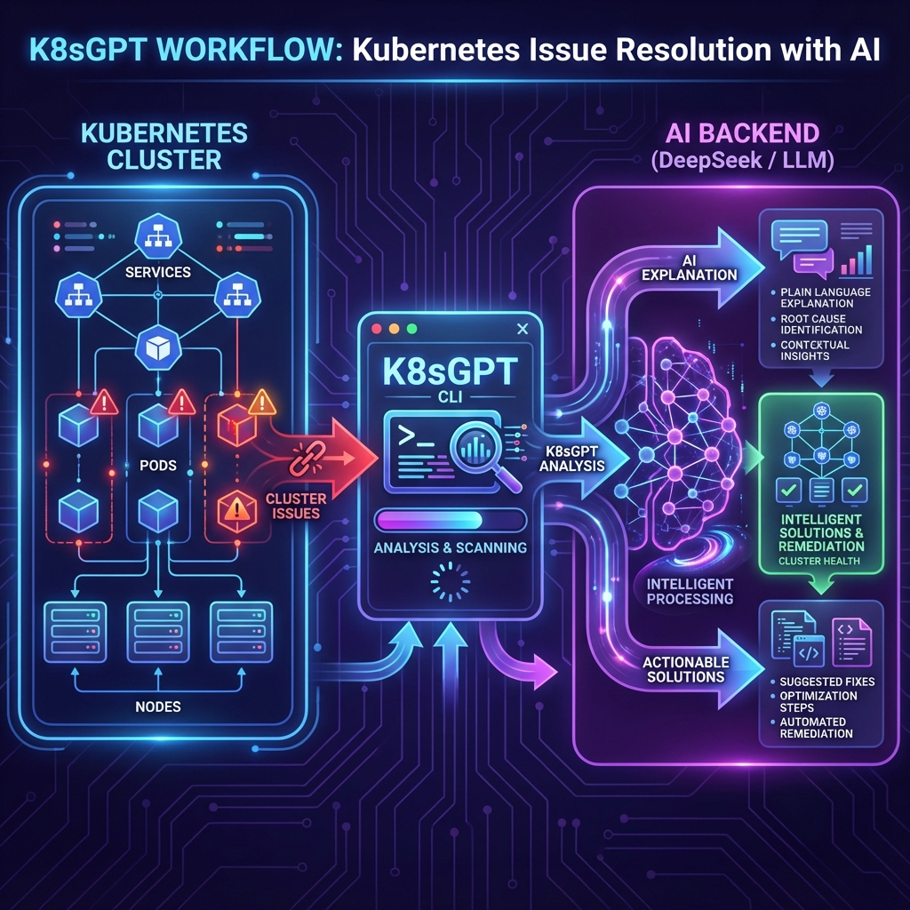

> **导语**：还在人肉排查 Kubernetes 故障？还在 Google 搜索那些晦涩的错误信息？今天介绍一款 AIOps 神器 **K8sGPT**，让 AI 自动分析你的集群问题，并给出可执行的修复建议！更重要的是，我们将使用国产大模型 **DeepSeek** 来驱动它，成本更低、响应更快！

---

## 🎯 痛点：Kubernetes 运维的噩梦

作为 SRE 或 DevOps 工程师，你是否经历过这些场景？

```
😰 凌晨3点被告警吵醒，看到一堆 CrashLoopBackOff，不知从何下手
😤 面对 ImagePullBackOff 错误，要翻遍日志才能定位问题
🤯 遇到 Pending Pod，需要检查 Node、PVC、ResourceQuota 等十几个可能原因
😵 新人入职，面对复杂的 K8s 错误信息束手无策
```

**传统排障流程：**
1. 看告警 → 2. kubectl describe → 3. kubectl logs → 4. Google搜索 → 5. 尝试修复 → 6. 重复...

**这个过程太低效了！** 如果有一个 AI 助手能够：
- ✅ 自动扫描整个集群的健康状态
- ✅ 识别所有潜在问题
- ✅ 用人类语言解释问题根因
- ✅ 给出可执行的修复建议

这就是今天要介绍的 **K8sGPT**！

---

## 🚀 K8sGPT 是什么？


*K8sGPT 工作流程：集群问题 → AI 分析 → 智能解释 → 修复建议*

**K8sGPT** 是一个开源的 Kubernetes 集群诊断工具，它能够：

| 功能 | 描述 |
|------|------|
| 🔍 **自动扫描** | 扫描集群中的 Pod、Service、Deployment 等资源，自动发现问题 |
| 🤖 **AI 解释** | 将技术错误信息翻译成人类可读的语言 |
| 💡 **修复建议** | 提供具体的、可执行的修复步骤 |
| 🔒 **数据匿名化** | 敏感信息在发送给 AI 前自动脱敏 |
| 🔌 **多模型支持** | 支持 OpenAI、DeepSeek、Ollama 等多种 AI 后端 |

### 项目信息

- 🌟 **GitHub Stars**: 6.5k+
- 🏆 **CNCF Sandbox 项目**
- 📦 **活跃维护中**，每周都有更新
- 🌐 **官网**: [k8sgpt.ai](https://k8sgpt.ai)

---

## 💡 为什么选择 DeepSeek？

在选择 AI 后端时，我强烈推荐使用 **DeepSeek**，原因如下：

| 对比项 | OpenAI GPT-4 | DeepSeek V3 |
|--------|--------------|-------------|
| **价格** | $30/1M tokens | ¥1/1M tokens（便宜30倍！） |
| **速度** | 中等 | 更快 |
| **中文能力** | 优秀 | 更优秀 |
| **隐私合规** | 境外服务器 | 国内服务器，合规性更好 |
| **API兼容** | 原生 | OpenAI 兼容 |

**DeepSeek V3** 是目前性价比最高的大模型之一，完全兼容 OpenAI API 格式，可以无缝接入 K8sGPT！

---

## 🛠️ 安装指南

### 1. 安装 K8sGPT CLI

**macOS/Linux (推荐使用 Homebrew)**:

```bash
# 添加 tap 并安装
brew tap k8sgpt-ai/k8sgpt
brew install k8sgpt

# 验证安装
k8sgpt version
```

**Linux (RPM/DEB)**:

```bash
# Debian/Ubuntu (64位)
curl -LO https://github.com/k8sgpt-ai/k8sgpt/releases/download/v0.4.26/k8sgpt_amd64.deb
sudo dpkg -i k8sgpt_amd64.deb

# CentOS/RHEL (64位)
sudo rpm -ivh https://github.com/k8sgpt-ai/k8sgpt/releases/download/v0.4.26/k8sgpt_amd64.rpm
```

**Windows**:

从 [GitHub Releases](https://github.com/k8sgpt-ai/k8sgpt/releases) 下载 Windows 二进制文件，解压后添加到 PATH。

### 2. 获取 DeepSeek API Key

1. 访问 [DeepSeek 开放平台](https://platform.deepseek.com/)
2. 注册/登录账号
3. 在控制台创建 API Key
4. 复制保存你的 API Key（格式：`sk-xxxxxxxxxxxxxxxx`）

**注意**：新用户通常有免费额度，足够测试使用！

### 3. 配置 K8sGPT 使用 DeepSeek

由于 DeepSeek 完全兼容 OpenAI API 格式，我们可以使用 `localai` 后端来连接：

```bash
# 添加 DeepSeek 作为 AI 后端
k8sgpt auth add \
  --backend localai \
  --model deepseek-chat \
  --baseurl https://api.deepseek.com/v1 \
  --password sk-your-deepseek-api-key

# 验证配置
k8sgpt auth list
```

**输出示例**：
```
Default:
> localai
Active:
> localai
Unused:
> openai
> ollama
...
```

### 4. 设置为默认后端

```bash
# 将 localai (DeepSeek) 设置为默认
k8sgpt auth default -p localai

# 确认设置
k8sgpt auth list
```

---

## ⚡ 快速开始：5分钟体验 K8sGPT

### 基础用法

```bash
# 1. 扫描集群问题（不使用AI解释）
k8sgpt analyze

# 2. 扫描并使用 AI 解释问题
k8sgpt analyze --explain

# 3. 扫描并附带官方文档链接
k8sgpt analyze --explain --with-doc
```

### 实战演示

让我们模拟一个有问题的 Pod，看看 K8sGPT 如何诊断：

```bash
# 创建一个有问题的 Pod（镜像不存在）
kubectl run broken-pod --image=nginx:nonexistent

# 等待几秒后，使用 K8sGPT 分析
k8sgpt analyze --explain
```

**K8sGPT 输出示例**：

```
🔍 Analyzing cluster...

Pod: default/broken-pod
━━━━━━━━━━━━━━━━━━━━━━━━━━━━━━━━━━━━━━━━━━━━━━━━━━━━━━━━━━━━━━━━━━━━━━━━━━
⚠️  Issue: Back-off pulling image "nginx:nonexistent"

🤖 AI Explanation:
该 Pod 无法启动，因为 Kubernetes 无法从镜像仓库拉取指定的镜像 
"nginx:nonexistent"。这通常有以下几种原因：

1. **镜像名称或标签错误**: 镜像 "nginx:nonexistent" 中的标签 "nonexistent" 
   可能不存在于 Docker Hub 上。

2. **私有仓库认证问题**: 如果是私有仓库，需要配置 imagePullSecrets。

3. **网络问题**: 节点可能无法访问镜像仓库。

💡 修复建议:
1. 检查镜像名称是否正确，可以使用 docker pull nginx:nonexistent 测试
2. 使用有效的镜像标签，如 nginx:latest 或 nginx:1.25
3. 如果是私有仓库，创建并配置 imagePullSecrets
4. 检查节点网络是否能访问 Docker Hub

📖 运行命令修复:
kubectl set image pod/broken-pod broken-pod=nginx:latest
━━━━━━━━━━━━━━━━━━━━━━━━━━━━━━━━━━━━━━━━━━━━━━━━━━━━━━━━━━━━━━━━━━━━━━━━━━
```

**这就是 K8sGPT 的魅力！** 不仅告诉你出了什么问题，还解释原因并给出修复命令！

---

## 🔧 高级用法

### 1. 按资源类型过滤

```bash
# 只分析 Pod 问题
k8sgpt analyze --explain --filter=Pod

# 只分析 Service 问题
k8sgpt analyze --explain --filter=Service

# 分析多种资源
k8sgpt analyze --explain --filter=Pod,Service,Ingress
```

### 2. 按命名空间过滤

```bash
# 只分析 production 命名空间
k8sgpt analyze --explain --namespace=production

# 分析所有命名空间
k8sgpt analyze --explain --namespace=""
```

### 3. 输出为 JSON 格式

```bash
# JSON 输出，便于自动化处理
k8sgpt analyze --explain --output=json | jq .
```

### 4. 数据匿名化

```bash
# 敏感数据（Pod名、命名空间等）在发送给 AI 前自动脱敏
k8sgpt analyze --explain --anonymize
```

这对于需要遵守数据安全合规的企业非常重要！

### 5. 查看分析统计

```bash
# 显示每个分析器的耗时统计
k8sgpt analyze -s
```

输出：
```
- Analyzer Ingress took 47.125583ms
- Analyzer PersistentVolumeClaim took 53.009167ms
- Analyzer CronJob took 57.517792ms
- Analyzer Deployment took 156.6205ms
- Analyzer Node took 160.109833ms
- Analyzer Pod took 5.662594708s
- Analyzer Service took 38.583359166s
```

---

## 📊 内置分析器

K8sGPT 内置了丰富的分析器，覆盖 Kubernetes 核心资源：

### 默认启用的分析器

| 分析器 | 资源类型 | 检测内容 |
|--------|----------|----------|
| `podAnalyzer` | Pod | CrashLoopBackOff, ImagePullBackOff, Pending 等 |
| `deploymentAnalyzer` | Deployment | 副本不一致、更新失败 |
| `serviceAnalyzer` | Service | 端口配置错误、选择器不匹配 |
| `ingressAnalyzer` | Ingress | 配置错误、后端服务不存在 |
| `pvcAnalyzer` | PVC | 绑定失败、存储类不存在 |
| `nodeAnalyzer` | Node | 节点不健康、资源不足 |
| `eventAnalyzer` | Event | 异常事件检测 |
| `statefulSetAnalyzer` | StatefulSet | 副本问题 |
| `jobAnalyzer` | Job | 失败任务 |
| `cronJobAnalyzer` | CronJob | 调度问题 |
| `configMapAnalyzer` | ConfigMap | 配置问题 |
| `webhookAnalyzer` | Webhook | 准入控制问题 |

### 可选分析器

```bash
# 查看所有可用分析器
k8sgpt filters list

# 启用额外的分析器
k8sgpt filters add hpaAnalyzer,networkPolicyAnalyzer,securityAnalyzer

# 禁用某个分析器
k8sgpt filters remove eventAnalyzer
```

可选分析器包括：
- `hpaAnalyzer` - HorizontalPodAutoscaler 分析
- `pdbAnalyzer` - PodDisruptionBudget 分析
- `networkPolicyAnalyzer` - 网络策略分析
- `securityAnalyzer` - 安全配置分析
- `storageAnalyzer` - 存储分析
- `logAnalyzer` - 日志分析

---

## 🐳 Kubernetes Operator 模式

除了 CLI 工具，K8sGPT 还提供 **Operator 模式**，实现持续监控！

### 安装 K8sGPT Operator

```bash
# 添加 Helm 仓库
helm repo add k8sgpt https://charts.k8sgpt.ai
helm repo update

# 创建命名空间
kubectl create namespace k8sgpt

# 安装 Operator
helm install k8sgpt-operator k8sgpt/k8sgpt-operator \
  -n k8sgpt \
  --set serviceMonitor.enabled=true
```

### 创建 K8sGPT 资源

创建 `k8sgpt-deepseek.yaml`：

```yaml
apiVersion: core.k8sgpt.ai/v1alpha1
kind: K8sGPT
metadata:
  name: k8sgpt-deepseek
  namespace: k8sgpt
spec:
  ai:
    enabled: true
    backend: localai
    baseUrl: https://api.deepseek.com/v1
    model: deepseek-chat
    secret:
      name: deepseek-secret
      key: api-key
  noCache: false
  version: v0.4.26
  # 可选：集成 Trivy 安全扫描
  integrations:
    trivy:
      enabled: true
      namespace: trivy-system
---
apiVersion: v1
kind: Secret
metadata:
  name: deepseek-secret
  namespace: k8sgpt
type: Opaque
stringData:
  api-key: sk-your-deepseek-api-key
```

```bash
# 应用配置
kubectl apply -f k8sgpt-deepseek.yaml

# 查看结果
kubectl get results -n k8sgpt
```

### 集成 Prometheus & Alertmanager

Operator 模式可以直接对接你的监控系统：

```yaml
spec:
  sink:
    webhook:
      url: http://alertmanager:9093/api/v1/alerts
```

当 K8sGPT 发现问题时，会自动发送告警到 Alertmanager！

---

## 🔐 安全与隐私

### 数据匿名化原理

K8sGPT 的匿名化功能非常智能：

```
原始数据：
  Pod: production/super-secret-payment-pod-abc123

发送给 AI：
  Pod: k8s-masked/tGLcCRcHa1Ce5Rs

AI 返回：
  "Pod tGLcCRcHa1Ce5Rs 存在问题..."

显示给用户：
  "Pod super-secret-payment-pod-abc123 存在问题..."
```

### 匿名化覆盖范围

| 已匿名化 | 未匿名化（无敏感信息） |
|----------|----------------------|
| Deployment, StatefulSet | ReplicaSet |
| Service, Ingress | PersistentVolumeClaim |
| Node, NetworkPolicy | Pod（基本信息） |
| HPA, CronJob | Event Messages* |
| PodDisruptionBudget | Log 内容* |

*注：Event 和 Log 内容匿名化功能正在开发中。

---

## 📈 与其他 AI 后端对比

| 后端 | 优势 | 劣势 | 适用场景 |
|------|------|------|----------|
| **DeepSeek** | 便宜、快速、中文优秀 | 需网络访问 | 生产环境首选 |
| **OpenAI** | 效果最好 | 贵、境外 | 不差钱用户 |
| **Ollama** | 本地运行、完全私有 | 需要 GPU | 离线/高隐私需求 |
| **Azure OpenAI** | 企业合规 | 配置复杂 | 企业用户 |
| **LocalAI** | 本地运行、灵活 | 资源消耗 | 自托管需求 |

---

## 💡 最佳实践

### 1. 日常巡检

```bash
# 每天早上运行一次全面扫描
k8sgpt analyze --explain --output=json > /var/log/k8sgpt/$(date +%Y%m%d).json
```

### 2. CI/CD 集成

```yaml
# .gitlab-ci.yml 示例
k8s-health-check:
  stage: post-deploy
  script:
    - k8sgpt analyze --output=json > report.json
    - |
      if jq -e '.results | length > 0' report.json; then
        echo "⚠️ Cluster issues detected!"
        k8sgpt analyze --explain
        exit 1
      fi
```

### 3. 结合 Slack 通知

```bash
# 发现问题时发送 Slack 通知
k8sgpt analyze --explain --output=json | \
  jq -r '.results[] | "⚠️ \(.kind): \(.name)\n\(.error)"' | \
  curl -X POST -H 'Content-type: application/json' \
    --data "{\"text\":\"$(cat)\"}" \
    https://hooks.slack.com/services/YOUR/WEBHOOK/URL
```

### 4. 使用 DeepSeek R1 推理模型

如果遇到复杂问题，可以切换到 DeepSeek R1（推理增强模型）：

```bash
# 使用 DeepSeek R1 进行深度分析
k8sgpt auth add \
  --backend localai \
  --model deepseek-reasoner \
  --baseurl https://api.deepseek.com/v1 \
  --password sk-your-api-key

k8sgpt analyze --explain --backend localai
```

---

## 🔍 故障排除

### Q1: 连接 DeepSeek 失败？

```bash
# 检查网络连通性
curl -H "Authorization: Bearer sk-your-key" \
  https://api.deepseek.com/v1/models

# 检查 API Key 是否正确
k8sgpt auth list

# 重新添加认证
k8sgpt auth remove -b localai
k8sgpt auth add --backend localai --model deepseek-chat \
  --baseurl https://api.deepseek.com/v1 --password sk-xxx
```

### Q2: 分析结果为空？

```bash
# 可能集群没有问题！创建一个测试问题：
kubectl run test-broken --image=nginx:nonexistent

# 或者检查过滤器配置
k8sgpt filters list
```

### Q3: AI 返回内容不完整？

可能是 Token 限制问题，尝试使用更强大的模型：

```bash
k8sgpt auth add --backend localai \
  --model deepseek-chat \
  --baseurl https://api.deepseek.com/v1 \
  --password sk-xxx
```

---

## 📚 相关资源

| 资源 | 链接 |
|------|------|
| **K8sGPT GitHub** | [github.com/k8sgpt-ai/k8sgpt](https://github.com/k8sgpt-ai/k8sgpt) |
| **K8sGPT 官方文档** | [docs.k8sgpt.ai](https://docs.k8sgpt.ai) |
| **K8sGPT Operator** | [github.com/k8sgpt-ai/k8sgpt-operator](https://github.com/k8sgpt-ai/k8sgpt-operator) |
| **DeepSeek 开放平台** | [platform.deepseek.com](https://platform.deepseek.com) |
| **DeepSeek API 文档** | [api-docs.deepseek.com](https://api-docs.deepseek.com) |

---

## 📝 总结

**K8sGPT + DeepSeek** 的组合为 Kubernetes 运维带来了革命性的体验：

| 收益 | 描述 |
|------|------|
| ⚡ **效率提升 10 倍** | 从人肉排障到 AI 秒级诊断 |
| 💰 **成本极低** | DeepSeek 价格仅为 GPT-4 的 1/30 |
| 🧠 **降低门槛** | 新人也能快速定位问题 |
| 🔒 **数据安全** | 匿名化处理，保护敏感信息 |
| 🔄 **持续监控** | Operator 模式实现 7x24 自动巡检 |
| 🇨🇳 **中文友好** | DeepSeek 中文能力出色 |

### 一句话总结

> **K8sGPT 让你从"人肉运维"进化到"AI 运维"，而 DeepSeek 让这一切变得经济实惠！**

---

## 🎬 下一步行动

1. ⬇️ **立即安装**: `brew install k8sgpt`
2. 🔑 **获取 Key**: 注册 DeepSeek 获取免费额度
3. ⚙️ **配置后端**: `k8sgpt auth add --backend localai ...`
4. 🔍 **开始分析**: `k8sgpt analyze --explain`
5. 🚀 **持续优化**: 部署 Operator 实现自动化

---

> 🎉 **觉得有用？欢迎点赞、收藏、转发！**
> 
> 💬 **有问题或建议？欢迎评论区交流！**

---

*本文作者：云原生技术爱好者*  
*发布日期：2024年12月14日*  
*专注云原生、虚拟化与 AIOps 领域，欢迎关注！*
