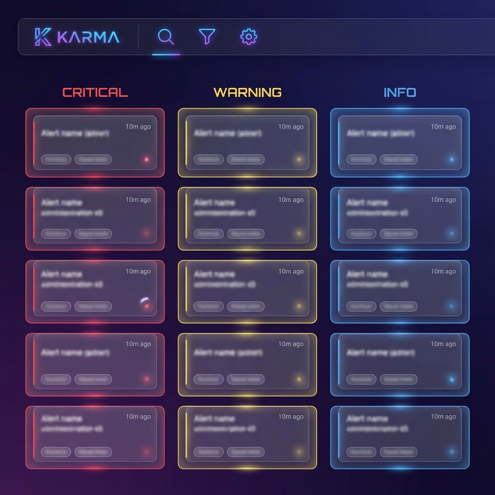
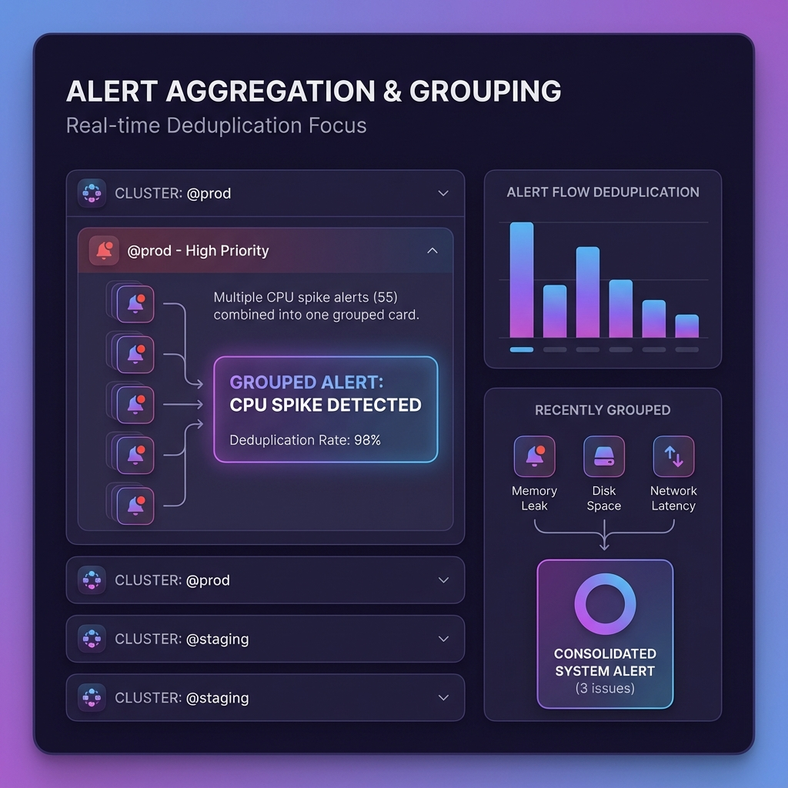
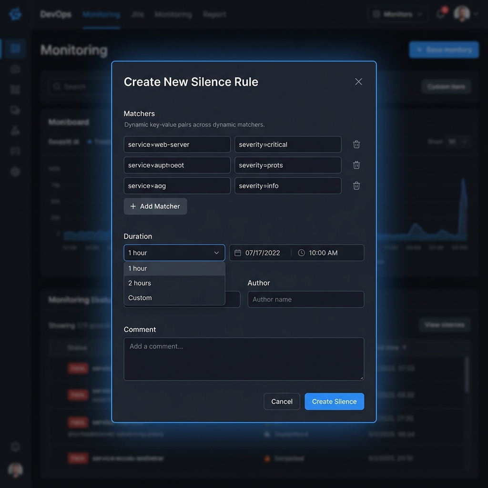

> **导语**：还在为 Alertmanager 原生UI的简陋界面头疼？还在多个告警实例之间来回切换？今天介绍一款开源神器 **Karma**，它能让你的告警管理效率提升10倍！

---

## 🎯 为什么需要 Karma？

作为 SRE 或运维工程师，你是否遇到过这些痛点？

- 😩 **告警风暴**：线上故障时，成百上千条相似告警刷屏，重要信息被淹没
- 🔀 **多集群管理**：需要在多个 Alertmanager 实例之间来回切换
- 👀 **可视化差**：原生 Alertmanager UI 功能有限，无法快速定位问题
- 🤯 **静默管理困难**：创建和管理 Silence 规则效率低下

如果你有以上任何一个痛点，那么 **Karma** 就是为你量身定制的解决方案！


*使用 Karma 前后的告警管理体验对比*

---

## 🚀 Karma 是什么？


*Karma 主仪表板界面 - 精美的暗色主题，告警按严重级别分层展示*

**Karma** 是一个专为 Prometheus Alertmanager 打造的告警仪表板，它能够：

| 功能 | 描述 |
|------|------|
| 🔗 **多实例聚合** | 聚合多个 Alertmanager 实例的告警，统一展示 |
| 📊 **智能分组** | 基于标签的多维度告警分组，快速定位问题 |
| 🔇 **静默管理** | 一键创建、编辑、删除 Silence 规则 |
| 🌙 **暗黑模式** | 支持深色主题，保护你的眼睛 |
| ⚡ **实时更新** | 告警状态实时刷新，不错过任何变化 |
| 🎯 **告警去重** | 自动去除重复告警，减少噪音干扰 |

---

## ✨ 六大核心功能详解

### 1️⃣ 告警聚合与去重

从 `v0.7.0` 版本开始，Karma 支持聚合来自多个 Alertmanager 实例的告警，无论是 **HA 模式** 还是 **独立部署** 的实例都能完美支持。

```
特性亮点：
✅ 自动去除重复告警
✅ 每个告警标记来源 Alertmanager 实例
✅ 支持 @alertmanager 和 @cluster 标签过滤
```


*多集群告警聚合展示 - 使用 @cluster 标签区分来源*

想象一下，你有 3 个 Alertmanager 高可用集群，Karma 可以将所有告警统一展示，并用 `@cluster` 标签区分来源，再也不用在多个页面之间来回切换！

### 2️⃣ 智能告警分组

Karma 会保留 Alertmanager 中 `group_by` 的配置，以分组形式展示告警：

```yaml
# Alertmanager 配置示例
route:
  group_by: ['alertname', 'cluster', 'service']
  group_wait: 10s
  group_interval: 10s
```

**分组展示的优势：**
- 📦 相关告警聚合在一起，便于分析
- 🔼🔽 支持展开/折叠，灵活控制显示
- 📎 公共标签和注解自动提取到页脚

### 3️⃣ 基于标签的多层网格

这是 Karma 最强大的功能之一！你可以根据任意标签（如 `severity`、`environment`）创建多层网格视图：

```
┌─────────────────────────────────────────────────┐
│                  🔴 Critical                     │
│  ┌─────────┐ ┌─────────┐ ┌─────────┐            │
│  │ Alert 1 │ │ Alert 2 │ │ Alert 3 │            │
│  └─────────┘ └─────────┘ └─────────┘            │
├─────────────────────────────────────────────────┤
│                  🟡 Warning                      │
│  ┌─────────┐ ┌─────────┐                        │
│  │ Alert 4 │ │ Alert 5 │                        │
│  └─────────┘ └─────────┘                        │
├─────────────────────────────────────────────────┤
│                  🟢 Info                         │
│  ┌─────────┐                                    │
│  │ Alert 6 │                                    │
│  └─────────┘                                    │
└─────────────────────────────────────────────────┘
```

这种视图让你能够：
- 🎯 **一眼定位** 最严重的告警
- 🏷️ **按环境** 区分生产/测试/开发环境告警
- 📊 **按服务** 快速了解各服务健康状态

### 4️⃣ 强大的静默管理

创建 Silence 规则从未如此简单：


*创建 Silence 规则 - 简洁直观的表单设计*

```
🔇 一键静默：点击告警，一键创建匹配的 Silence
📝 批量操作：支持批量创建和管理 Silence
🔐 权限控制：支持 ACL 规则，限制谁可以创建/编辑 Silence
⏰ 过期提醒：显示最近过期的 Silence，方便续期
```

### 5️⃣ 告警确认机制

从 `v0.50` 版本开始，Karma 支持 **一键确认** 告警：

```bash
# 配合 kthxbye 使用，可以创建自动延长的 Silence
# 只有当所有告警恢复后，Silence 才会自动删除
```

这个功能特别适合：
- 🔧 已知问题处理中，避免重复通知
- 🌙 夜间值班，快速确认已知告警

### 6️⃣ Dead Man's Switch 支持

从 `v0.78` 版本开始，Karma 可以检测 **死人开关** 类型的告警：

```yaml
# 配置示例
alertmanager:
  servers:
    - name: prod
      uri: http://alertmanager:9093
      healthcheck:
        filters:
          - alertname=Watchdog
```

如果 Watchdog 告警不存在，Karma 会立即显示错误提示，帮助你发现监控系统本身的问题！

---

## 🛠️ 快速部署指南

### 方式一：Docker 部署（推荐）

```bash
# 使用官方镜像快速启动
docker run -d \
  --name karma \
  -p 8080:8080 \
  -e ALERTMANAGER_URI=http://your-alertmanager:9093 \
  ghcr.io/prymitive/karma:latest
```

### 方式二：Kubernetes 部署

```yaml
apiVersion: apps/v1
kind: Deployment
metadata:
  name: karma
  namespace: monitoring
spec:
  replicas: 1
  selector:
    matchLabels:
      app: karma
  template:
    metadata:
      labels:
        app: karma
    spec:
      containers:
      - name: karma
        image: ghcr.io/prymitive/karma:latest
        ports:
        - containerPort: 8080
        env:
        - name: ALERTMANAGER_URI
          value: "http://alertmanager:9093"
        livenessProbe:
          httpGet:
            path: /health
            port: 8080
          initialDelaySeconds: 5
          periodSeconds: 10
        readinessProbe:
          httpGet:
            path: /health
            port: 8080
          initialDelaySeconds: 5
          periodSeconds: 10
---
apiVersion: v1
kind: Service
metadata:
  name: karma
  namespace: monitoring
spec:
  selector:
    app: karma
  ports:
  - port: 80
    targetPort: 8080
  type: ClusterIP
```

### 方式三：配置文件部署（多 Alertmanager 实例）

创建 `karma.yaml` 配置文件：

```yaml
alertmanager:
  interval: 30s
  servers:
    - name: production
      uri: http://alertmanager-prod:9093
      timeout: 20s
      proxy: true
      headers:
        X-Auth-Token: secret-token

    - name: staging
      uri: http://alertmanager-staging:9093
      timeout: 20s
      readonly: true  # 只读模式，禁止创建 Silence

    - name: development
      uri: http://alertmanager-dev:9093
      timeout: 10s

# UI 设置
ui:
  refresh: 30s
  hideFiltersWhenIdle: true
  colorTitlebar: true
  theme: auto  # 自动跟随系统主题

# 标签过滤
labels:
  color:
    static:
      - severity
    unique:
      - instance
      - pod
  keep:
    - alertname
    - severity
    - cluster
    - namespace
  strip:
    - prometheus_replica

# 告警历史
history:
  enabled: true
  timeout: 20s

# 网格配置
grid:
  sorting:
    order: startsAt
    reverse: true
    label: severity
    customValues:
      severity:
        critical: 1
        warning: 2
        info: 3

# 日志级别
log:
  level: info
  format: json
```

启动 Karma：

```bash
karma --config.file=karma.yaml
```

---

## 🎨 界面预览

### 主仪表板


*Karma 主界面 - 支持暗色/亮色主题切换*

Karma 的主界面清晰直观，一眼就能看到：

- 📊 **告警总数统计**：左上角实时显示当前告警数量
- 🏷️ **过滤器**：支持通过标签快速筛选告警
- 📦 **告警分组**：按配置的规则聚合展示
- 🎛️ **设置面板**：自定义主题、刷新间隔等

### 暗黑模式

从 `v0.52` 开始支持暗黑模式，自动跟随浏览器/系统偏好：

```css
/* 浏览器会根据系统设置自动切换主题 */
@media (prefers-color-scheme: dark) {
  /* 暗黑主题 */
}
```

---

## 💡 最佳实践

### 1. 合理配置告警分组

```yaml
# 推荐的 Alertmanager 分组配置
route:
  group_by: ['alertname', 'cluster', 'namespace']
  group_wait: 30s
  group_interval: 5m
  repeat_interval: 4h
```

### 2. 利用标签网格

```yaml
# Karma 配置：按严重级别分层展示
grid:
  sorting:
    label: severity
    customValues:
      severity:
        critical: 1
        warning: 2
        info: 3
```

### 3. 配置告警确认

```yaml
# 开启一键确认功能
alertAcknowledgement:
  enabled: true
  duration: 15m
  author: karma
  comment: "ACK! This alert was acknowledged by $AUTHOR"
```

### 4. 对接 SSO 认证

Karma 支持多种认证方式：

```yaml
authentication:
  header:
    name: X-Forwarded-User
    value_re: ^(.+)$
  # 或使用 BasicAuth
  basicAuth:
    users:
      - username: admin
        password: $2a$10$... # bcrypt hash
```

---

## 📊 与类似工具对比

| 功能 | Karma | Alertmanager UI | Prometheus UI |
|------|-------|-----------------|---------------|
| 多实例聚合 | ✅ | ❌ | ❌ |
| 告警去重 | ✅ | ❌ | ❌ |
| 标签网格 | ✅ | ❌ | ❌ |
| 暗黑模式 | ✅ | ❌ | ✅ |
| 静默管理 | ✅✅ | ✅ | ❌ |
| 告警历史 | ✅ | ❌ | ✅ |
| 一键确认 | ✅ | ❌ | ❌ |
| ACL 权限 | ✅ | ❌ | ❌ |

---

## 🔗 相关资源

- **GitHub 仓库**：[https://github.com/prymitive/karma](https://github.com/prymitive/karma)
- **在线 Demo**：[https://demo.karma-dashboard.io/](https://demo.karma-dashboard.io/)
- **配置文档**：[CONFIGURATION.md](https://github.com/prymitive/karma/blob/main/docs/CONFIGURATION.md)
- **ACL 文档**：[ACLs.md](https://github.com/prymitive/karma/blob/main/docs/ACLs.md)

---

## 📝 总结

**Karma** 是一个强大且成熟的 Alertmanager 仪表板工具，它能够帮助你：

| 收益 | 描述 |
|------|------|
| ⚡ **提升效率** | 统一管理多个 Alertmanager 实例，告别来回切换 |
| 🧘 **减少噪音** | 智能去重和分组，告别告警风暴 |
| 🎯 **快速定位** | 多维度分组视图，一眼定位问题根源 |
| 🔒 **权限管控** | ACL 规则精细控制静默权限 |
| 🌙 **护眼模式** | 暗黑主题支持，保护夜班值班人员 |

如果你正在使用 Prometheus + Alertmanager 监控栈，**强烈推荐** 部署 Karma 来提升你的告警管理体验！

---

> 🎉 **体验一下**：[https://demo.karma-dashboard.io/](https://demo.karma-dashboard.io/)
> 
> 📢 **觉得有用？欢迎点赞、收藏、转发！**

---

*本文作者：云原生技术爱好者*  
*发布日期：2024年12月11日*
