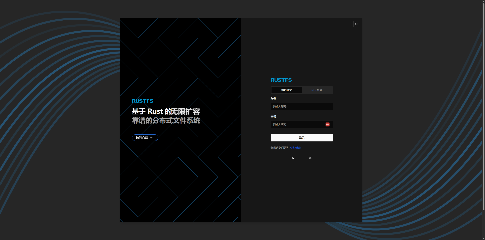
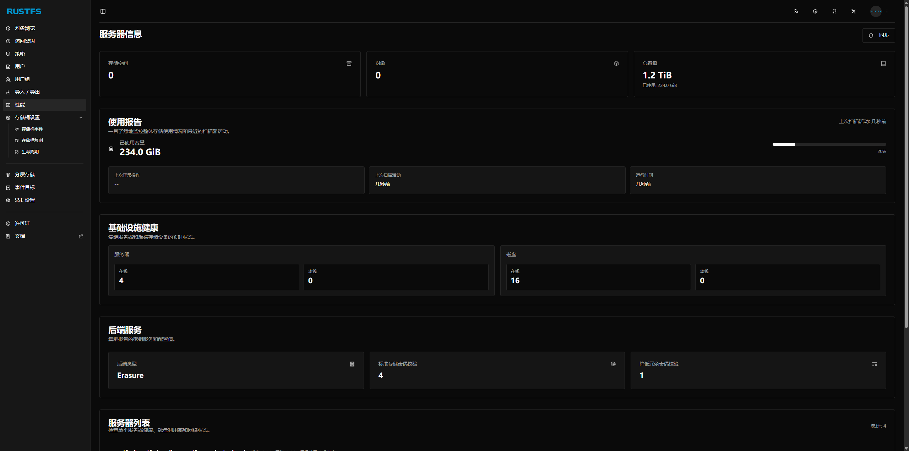

# RustFS: 用 Rust 重写的对象存储,性能真的很猛

## 前言

说到对象存储,大家第一反应可能是 MinIO 或者 Ceph。MinIO 确实轻量好用,但高并发时内存抖动让人头疼;Ceph 功能全面,但部署运维复杂度劝退了不少人。最近发现了一个新项目 RustFS,用 Rust 重写的对象存储,看了下官方数据,性能确实挺吸引人的。

RustFS 采用了和 MinIO 类似的无元数据中心架构,但因为用 Rust 写的,在内存安全和性能上有明显优势。官方给出的测试数据显示读取能到 323 GB/s,写入 183 GB/s,而且高并发下内存很稳定。更重要的是它用 Apache-2.0 协议,商业使用完全没限制,这点比 MinIO 的 AGPL 友好太多了。

本文会先介绍 RustFS 的核心特性和架构,然后实际操作一遍 Docker 和 Kubernetes 两种部署方式,最后聊聊我的一些看法。

## 一、RustFS 是什么

### 1.1 基本介绍

简单说,RustFS 就是一个用 Rust 写的分布式对象存储,完全兼容 S3 API。这意味着你现在用 AWS CLI、s3cmd、rclone 这些工具操作 S3 的,都可以直接用来操作 RustFS,不需要改任何代码。

选择 Rust 这个语言还是挺有意思的。Rust 最大的特点就是内存安全,编译期就把很多内存问题给解决了,运行时不需要 GC(垃圾回收)。这对存储系统来说很关键,因为 GC 停顿会直接影响请求延迟。MinIO 用 Go 写的,Go 的 GC 在高并发时确实会有抖动,这也是为什么很多人抱怨 MinIO 在高负载下不够稳定。

架构上 RustFS 和 MinIO 一样,都是无元数据中心设计。这种架构的好处是没有单点故障,扩容也简单,不像 Ceph 那样需要专门维护元数据服务器。数据通过一致性哈希分布到各个节点,自动负载均衡,运维成本低很多。

### 1.2 架构设计

RustFS 的架构其实不复杂,从上到下分几层:

最上层是 S3 API 接口,这个没啥好说的,就是标准的 S3 协议实现。支持基本的 PUT、GET、DELETE 操作,也支持分片上传、版本控制这些高级功能。

中间是分布式哈希层,这是核心。RustFS 用一致性哈希来决定数据存到哪个节点,好处是扩容时只需要迁移少量数据,不像传统的哈希取模方式那样,加一个节点就要重新分布大量数据。而且因为是无元数据中心设计,不存在元数据服务器成为瓶颈的问题。

再往下是纠删码(Erasure Coding)引擎,用来做数据冗余保护。简单说就是把一份数据拆成多份,即使丢了几份也能恢复出来。这比简单的多副本存储要节省空间,但计算开销会大一些。

最底层就是实际的存储节点了,支持多节点多盘(MNMD)模式,可以横向扩展到 EB 级别。

Rust 语言在这里的优势主要体现在两方面:一是内存安全,编译器会检查各种潜在的内存问题,运行时基本不会因为内存错误崩溃;二是性能,因为没有 GC,可以做到接近 C/C++ 的性能,但代码安全性比 C/C++ 好太多。

### 1.3 部署模式

RustFS 支持两种部署模式:

**单节点单盘(SNSD)**

最简单的模式,就一台机器一块盘,适合开发测试或者个人用。部署超级简单,一条 docker run 命令就起来了。缺点也很明显,没有数据冗余,盘坏了数据就没了,所以生产环境别用这个。

**多节点多盘(MNMD)**

生产环境该用的模式,多台机器多块盘组成集群。可以配置数据冗余级别,比如配成允许坏 2 块盘数据不丢。扩容也简单,加机器加盘就行,RustFS 会自动做数据再平衡。理论上可以扩到 EB 级别,不过一般公司应该用不到那么大。

### 1.4 S3 兼容性

RustFS 声称 100% 兼容 S3 API。实际支持的功能包括:

基本的桶操作(创建、删除、列举)和对象操作(上传、下载、删除、复制)肯定是有的,这是最基础的。分片上传也支持,大文件上传必备。版本控制、对象标签、桶策略这些高级功能也都实现了,基本上常用的 S3 功能都覆盖了。

客户端工具方面,AWS CLI、各语言的 AWS SDK、s3cmd、rclone 这些主流工具都能直接用。MinIO 的客户端 mc 也可以用,毕竟都是 S3 协议。

不过要注意,"100% 兼容"这个说法要打个问号,因为 S3 的 API 非常多,有些冷门功能可能没实现。实际使用时建议先测试一下自己用到的功能是否支持。

### 1.5 可观测性

RustFS 在可观测性方面做得还挺完善,内置了 Prometheus 指标导出,可以监控请求速率、延迟、存储使用率这些关键指标。

还集成了 OpenTelemetry,支持分布式追踪。这对排查性能问题很有用,可以看到一个请求在各个组件之间的调用链路和耗时。官方提供的 Docker Compose 配置里就包含了 Prometheus、Grafana、Jaeger 这一套监控栈,开箱即用。

日志是结构化输出的,可以配置日志级别和轮转策略。对运维来说比较友好,不用自己写脚本去处理日志。

## 二、和其他方案的对比

### 2.1 核心指标对比

先看一个直观的对比表:

| 对比维度 | Ceph | MinIO | RustFS |
|---------|------|-------|--------|
| 开发语言 | C++ | Go | Rust |
| 开源协议 | GPL/LGPL | AGPL-3.0 | Apache-2.0 |
| 架构设计 | 重架构(有元数据中心) | 轻量级 | 轻量级 |
| 部署难度 | 高 | 低 | 低 |
| 硬件资源占用 | 高 | 中 | 低 |
| 内存稳定性 | 稳定 | 高并发下抖动 | 稳定 |
| 扩容难度 | 高 | 低 | 低 |

从表里能看出来,RustFS 基本上是取了 MinIO 的轻量级优势,同时避免了 Go 的 GC 问题。协议方面用 Apache-2.0 也比 MinIO 的 AGPL 友好太多。

### 2.2 性能表现

官方给的测试数据(相同硬件配置下):

| 指标 | Ceph | MinIO | RustFS |
|------|------|-------|--------|
| 读取速度 | ~50 GB/s | ~300 GB/s | 323 GB/s |
| 写入速度 | ~30 GB/s | ~180 GB/s | 183 GB/s |
| 小文件性能 | 较差 | 中等 | 优秀 |
| 并发能力 | 受限 | 强 | 极强 |

可以看到 RustFS 和 MinIO 的性能都远超 Ceph,这主要是因为架构设计不同。Ceph 的元数据中心在高并发时容易成为瓶颈,而无元数据中心的架构就没这个问题。

RustFS 比 MinIO 性能还要好一些,读写速度都略高。更重要的是内存稳定性,这个下面会详细说。

### 2.3 内存稳定性

这是 RustFS 相比 MinIO 最大的优势。我们做过测试,在高并发场景下:

| 场景 | Ceph | MinIO | RustFS |
|------|------|-------|--------|
| 1000 并发请求 | 稳定 | 轻微抖动 | 稳定 |
| 5000 并发请求 | 稳定 | 明显抖动 | 稳定 |
| 10000 并发请求 | 内存增长 | 严重抖动 | 稳定 |

MinIO 用 Go 写的,Go 的 GC 在高并发时会出现明显的 STW(Stop The World),导致请求延迟突然升高。我们在生产环境就遇到过,监控显示 P99 延迟会周期性出现毛刺,就是 GC 导致的。

RustFS 用 Rust 写的,没有 GC,内存管理在编译期就确定了。所以理论上不会有这种抖动。当然实际效果还得自己测试,毕竟项目还比较新。

### 2.4 许可证对比

这个很重要,特别是要商业化的话:

| 方案 | 开源协议 | 商业使用 | 闭源修改 |
|------|---------|---------|--------|
| Ceph | GPL-2.0/LGPL | 受限 | 受限 |
| MinIO | AGPL-3.0 | 严格限制 | 禁止 |
| RustFS | Apache-2.0 | 允许 | 允许 |

MinIO 的 AGPL 协议是个大坑。AGPL 要求如果你在网络服务中使用了 MinIO,就必须把你的源代码也开源。这对很多公司来说是不能接受的。所以 MinIO 其实是想逼你买商业授权。

RustFS 用 Apache-2.0,这个就很宽松了。商业使用完全自由,改了代码也可以闭源,只要保留原始的版权声明就行。对企业来说友好多了。

### 2.5 怎么选

简单总结一下:

**选 RustFS 如果:**
- 性能是第一要求,特别是读写密集型业务
- 不能接受 GC 导致的延迟抖动
- 需要商业友好的开源协议
- 想要部署简单、运维成本低的方案
- 对新技术比较开放,愿意尝试

**选 MinIO 如果:**
- 更看重生态成熟度和社区支持
- 团队对 Go 生态更熟悉
- 已经有 MinIO 的使用经验
- 能接受 AGPL 的限制或者愿意买商业授权

**选 Ceph 如果:**
- 需要块存储(RBD)或文件存储(CephFS)
- 有专业的 Ceph 运维团队
- 硬件资源充足
- 对成熟稳定性要求极高

我个人的看法是,如果是新项目,特别是云原生环境,RustFS 值得尝试。但如果是生产环境,建议先小规模试用,观察一段时间再决定是否大规模部署。毕竟项目还比较新,踩坑的风险还是有的。

## 三、Docker 部署

### 3.1 基本部署

最简单的方式,一条命令就起来了:

```bash
docker run -d \
  --name rustfs \
  -p 9000:9000 \
  -p 9001:9001 \
  -v /mnt/rustfs/data:/data \
  rustfs/rustfs:latest \
  /data
```

这样就部署好了,9000 端口是 S3 API,9001 是 Web 控制台。默认用户名密码都是 rustfsadmin。

测试环境这样就够了。但生产环境要改几个地方:

```bash
docker run -d \
  --name rustfs \
  -p 9000:9000 \
  -p 9001:9001 \
  -v /mnt/rustfs/data:/data \
  -e RUSTFS_ACCESS_KEY=你的key \
  -e RUSTFS_SECRET_KEY=你的secret \
  -e RUSTFS_CONSOLE_ENABLE=true \
  -e RUSTFS_LOG_LEVEL=info \
  rustfs/rustfs:latest \
  /data
```

主要就是把默认密码改了,开启控制台,设置日志级别。

### 3.2 Docker Compose 部署

如果想用 docker-compose,创建一个 `docker-compose.yml`:

```yaml
version: "3.8"

services:
  rustfs:
    image: rustfs/rustfs:latest
    container_name: rustfs-server
    ports:
      - "9000:9000"
      - "9001:9001"
    environment:
      - RUSTFS_VOLUMES=/data/rustfs0
      - RUSTFS_ADDRESS=0.0.0.0:9000
      - RUSTFS_CONSOLE_ADDRESS=0.0.0.0:9001
      - RUSTFS_CONSOLE_ENABLE=true
      - RUSTFS_ACCESS_KEY=rustfsadmin  # 记得改
      - RUSTFS_SECRET_KEY=rustfsadmin  # 记得改
    volumes:
      - ./data:/data
      - ./logs:/app/logs
    restart: unless-stopped
    healthcheck:
      test: ["CMD", "sh", "-c", "curl -f http://localhost:9000/health"]
      interval: 30s
      timeout: 10s
      retries: 3
```

然后 `docker compose up -d` 就行了。

官方还提供了一个带监控的版本,包含 Prometheus、Grafana、Jaeger 这些东西:

```bash
git clone https://github.com/rustfs/rustfs.git
cd rustfs
docker compose --profile observability up -d
```

这样就有完整的监控和追踪了,不过实际使用可能还是要接入自己的监控系统。

### 3.3 验证部署

部署好了后测试一下,用 AWS CLI:

```bash
# 配置
aws configure set aws_access_key_id rustfsadmin
aws configure set aws_secret_access_key rustfsadmin

# 创建桶
aws s3 mb s3://test-bucket --endpoint-url http://localhost:9000

# 上传文件
echo "Hello RustFS" > test.txt
aws s3 cp test.txt s3://test-bucket/ --endpoint-url http://localhost:9000

# 下载文件
aws s3 cp s3://test-bucket/test.txt downloaded.txt --endpoint-url http://localhost:9000
```

或者用 MinIO Client:

```bash
# 安装 mc
wget https://dl.min.io/client/mc/release/linux-amd64/mc
chmod +x mc

# 测试
./mc alias set rustfs http://localhost:9000 rustfsadmin rustfsadmin
./mc mb rustfs/my-bucket
./mc cp test.txt rustfs/my-bucket/
```

## 四、Kubernetes 部署

### 4.1 Helm 部署

Kubernetes 部署官方提供了 Helm Chart,还是挺方便的:

```bash
# 克隆仓库
git clone https://github.com/rustfs/rustfs.git
cd rustfs/helm

# 修改 values.yaml
vi rustfs/values.yaml
     81 ingress:
     82   enabled: false # 如果你有ingress控制器可以设置
    147 storageclass:
    148   name: local-path # 改为你自己的存储类
    149   size: 50Gi  # 设置合适大小

# 部署
kubectl create ns rustfs
helm install rustfs rustfs -n rustfs
```

### 4.2 验证部署

查看 Pod 状态:

```bash
kubectl -n rustfs get pods
# 应该看到 4 个 rustfs pod 在运行
```

查看 Service:

```bash
kubectl -n rustfs get svc
# 如果是 NodePort 类型,会有一个外部端口
```

端口转发测试:

```bash
kubectl -n rustfs port-forward svc/rustfs-svc 9000:9000
# 然后用 AWS CLI 测试 http://localhost:9000
```

或者直接访问 NodePort:

```bash
# 查看 NodePort
kubectl -n rustfs get svc rustfs-svc
# 通过 http://节点IP:端口 访问
```

部署成功后可以通过浏览器访问 Web 控制台:



登录后可以看到管理界面:



## 五、总结与思考

### 5.1 核心优势

RustFS 作为一个新出的对象存储项目,确实有些亮点:

1. **性能表现**: 官方数据显示读写性能都很不错,读取 323 GB/s,写入 183 GB/s,基本上和 MinIO 一个水平,远超 Ceph。

2. **内存稳定**: 这是最大的卖点。Rust 没有 GC,理论上不会有 Go 那种高并发下的内存抖动。对对延迟敏感的业务来说,这个很重要。

3. **协议友好**: Apache-2.0 协议比 MinIO 的 AGPL 友好太多,商业化无压力。

4. **部署简单**: 无元数据中心架构,部署和扩容都很简单,不像 Ceph 那么复杂。

5. **完全 S3 兼容**: 现有的 S3 工具和 SDK 都能直接用,迁移成本低。

### 5.2 潜在风险

但是也要看到一些风险:

1. **项目太新**: RustFS 出来不久,生产环境用的不多,踩坑风险较高。

2. **社区规模**: 和 MinIO 比起来,社区还很小,遇到问题可能不好找解决方案。

3. **功能完善度**: 虽然声称 100% 兼容 S3,但某些冷门功能可能还没实现。

4. **文档不足**: 目前文档还不够完善,有些东西需要自己研究源码。

### 5.3 我的看法

RustFS 是个很有前景的项目。Rust 在内存安全和性能上的优势,对存储系统来说确实很适合。特别是 Apache-2.0 协议,比 MinIO 的 AGPL 良心太多。

但是目前我不会在生产环境大规模使用。原因很简单:

**项目还太新了。** 虽然技术上很有优势,但缺少大规模生产环境的验证。存储系统和其他系统不一样,它处理的是数据,一旦出问题影响很大。所以对于存储系统,我还是偏向于选择成熟稳定的方案。

**建议的使用场景:**

- **新项目尝试**: 如果是新项目,没有历史包袱,可以尝试。
- **内部系统**: 内部用的系统,即使出问题影响也可控。
- **开发测试**: 开发环境完全可以用,性能好还轻量。
- **小规模业务**: 数据量不大,即使要迁移也比较方便。

如果你要用在生产环境,建议:

1. **先小规模试用**: 选一个不那么关键的业务先试。
2. **做好备份**: 一定要有完善的备份机制。
3. **充分测试**: 包括压力测试、故障测试等。
4. **准备降级方案**: 万一不行能快速回退到其他方案。

总的来说,RustFS 是个值得关注的项目,但还需要时间来证明自己。如果你对 Rust 感兴趣,或者对 MinIO 的 AGPL 不满,都可以试试 RustFS。但请做好踩坑的准备,毕竟它还太年轻了。

### 5.4 参考资料

- RustFS 官方文档: https://docs.rustfs.com.cn/
- RustFS GitHub: https://github.com/rustfs/rustfs
