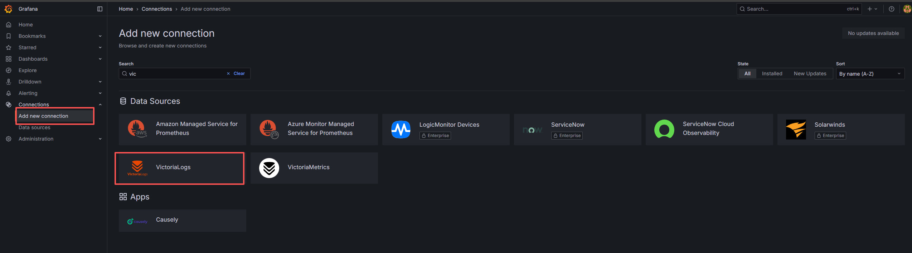
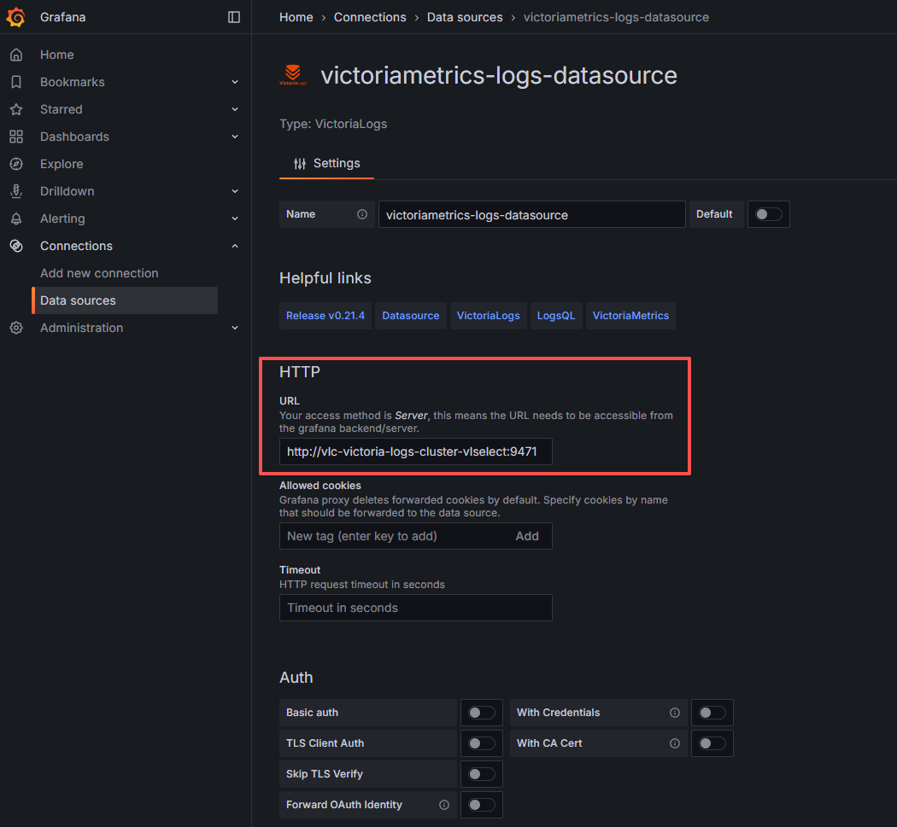
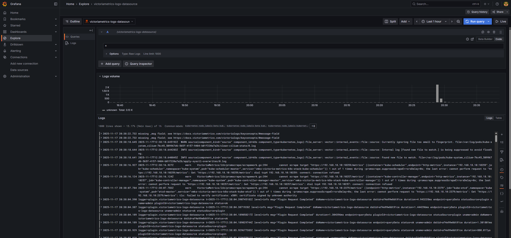
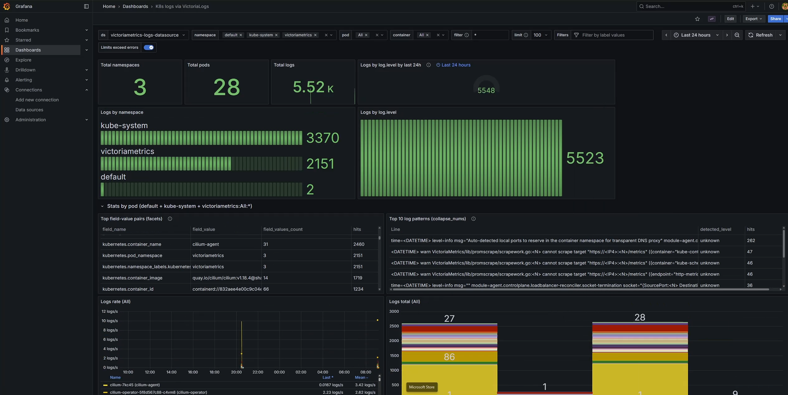

# VictoriaLogs: 新一代云原生日志管理方案

## 前言

在云原生时代,日志管理面临着前所未有的挑战:海量的日志数据、复杂的分布式架构、高昂的存储成本。传统的日志方案如 Elasticsearch 虽然功能强大,但资源消耗巨大;新兴方案如 Grafana Loki 虽然轻量,但查询能力有限。

**VictoriaLogs** 作为 VictoriaMetrics 家族的新成员,专为解决这些痛点而生。它不仅继承了 VictoriaMetrics 在时序数据处理上的卓越性能,更在日志领域实现了革命性突破。

## 一、VictoriaLogs 核心特性

### 1.1 什么是 VictoriaLogs?

**VictoriaLogs** 是一款开源、用户友好的日志数据库,由 VictoriaMetrics 团队开发。它专为云原生环境设计,目标是提供高性能、低成本的日志管理解决方案。

**核心优势:**

- 💾 **资源高效** - 相比 Elasticsearch 和 Loki,RAM 使用量减少高达 30 倍,磁盘空间减少高达 15 倍
- ⚡ **线性扩展** - 性能随 CPU、RAM、磁盘 I/O 等资源线性增长,从 Raspberry Pi 到数百核服务器均可顺畅运行
- 🚀 **易于运维** - 单一可执行文件,零配置启动,相比 Elasticsearch 和 Loki 更易于设置和操作
- 🔍 **强大查询** - LogsQL 查询语言支持快速全文搜索、高级分析和实时数据提取转换
- 🌐 **多种接入** - 支持主流日志采集器(Filebeat, Fluentbit, Logstash, Vector, Promtail 等)
- 📊 **高基数支持** - 完美支持 trace_id, user_id, ip 等高基数字段
- 📦 **宽事件优化** - 为包含数百个字段的日志优化

### 1.2 技术架构

VictoriaLogs 采用了创新的存储架构设计:

```
┌─────────────────────────────────────┐
│       VictoriaLogs 单节点           │
│                                     │
│  ┌───────────────────────────┐     │
│  │  Data Ingestion         │     │
│  │  - Syslog/JSON/Loki     │     │
│  │  - 实时数据流            │     │
│  │  - 自动解析              │     │
│  └───────────┬───────────────┘     │
│              ↓                      │
│  ┌───────────────────────────┐     │
│  │  Columnar Storage       │     │
│  │  - 列式存储引擎        │     │
│  │  - 高效压缩              │     │
│  │  - 自动索引              │     │
│  └───────────┬───────────────┘     │
│              ↓                      │
│  ┌───────────────────────────┐     │
│  │  Query Engine           │     │
│  │  - LogsQL 解析器        │     │
│  │  - 并行查询              │     │
│  │  - 结果缓存              │     │
│  └───────────────────────────┘     │
└─────────────────────────────────────┘
```

**关键技术特点:**

1. **列式存储引擎**
   - 按列存储日志字段,查询时只读取需要的列
   - 相比行式存储,I/O 效率提升 10 倍以上

2. **智能压缩算法**
   - 针对日志数据特点优化的压缩算法
   - 通常可达到 10-30 倍压缩比

3. **自动索引管理**
   - 无需手动配置索引策略
   - 摄入时自动创建和维护索引
   - 支持全文搜索和精确匹配

4. **流式处理架构**
   - 实时数据摄入无延迟
   - 支持实时查询(Live Tailing)
   - 支持乱序日志摄入(Backfilling)

### 1.3 LogsQL 查询语言

VictoriaLogs 提供了功能强大且易用的 LogsQL 查询语言:

**特点:**
- ✅ **简洁直观** - 类似 PromQL 的语法风格
- ✅ **全文搜索** - 支持关键词、短语、正则表达式
- ✅ **高级过滤** - 支持复杂的布尔逻辑组合
- ✅ **聚合分析** - 支持 count, sum, avg, min, max 等聚合函数
- ✅ **字段提取** - 查询时实时提取和转换数据

**示例查询:**
```logsql
# 查找包含 "error" 的日志
_msg:error

# 查找特定时间范围内的错误日志
_time:[now-1h, now] AND level:ERROR

# 复杂过滤条件
_msg:("failed" OR "timeout") AND service:api AND status:>=500

# 聚合统计
stats count() by (service, level)
```

### 1.4 多种数据接入方式

VictoriaLogs 支持多种日志接入协议:

- 📥 **Syslog** - 标准 Syslog 协议
- 📥 **JSON** - 结构化 JSON 日志
- 📥 **Loki API** - 兼容 Grafana Loki 协议
- 📥 **Elasticsearch Bulk API** - 兼容 ES API
- 📥 **CEF over Syslog** - 安全事件格式

**支持的采集器:**
- Filebeat
- Fluentbit  
- Logstash
- Vector
- Promtail
- Fluentd

### 1.5 部署模式

#### **单节点模式**

**适用场景:**
- 日志量: < 500GB/天
- 查询 QPS: < 100
- 中小型企业或部门

**特点:**
- ✅ 单一可执行文件
- ✅ 零配置启动
- ✅ 自动资源调优
- ✅ 极低运维成本

#### **集群模式**

**适用场景:**
- 日志量: > 500GB/天
- 查询 QPS: > 100
- 大型企业生产环境
- 需要高可用

**特点:**
- ✅ 水平扩展
- ✅ 数据分片和复制
- ✅ 高可用保障
- ✅ 支持数百节点规模

### 1.6 集成与生态

#### **Grafana 集成**

完美集成 Grafana:

- 📈 **官方插件** - VictoriaLogs Grafana Data Source
- 📈 **Dashboard 支持** - 构建任意日志仪表盘
- 📈 **告警集成** - 与 Grafana 告警系统集成
- 📈 **变量支持** - Dashboard 变量过滤

#### **内置 Web UI**

VictoriaLogs 提供了内置的 Web 界面:

- 📊 **日志浏览器** - 直观的日志查看界面
- 🔍 **查询编辑器** - LogsQL 语法高亮和自动补全
- 📊 **实时查询** - 实时显示日志流
- 📊 **上下文查看** - 查看选中日志的上下文

#### **高级特性**

**多租户支持:**
- 数据隔离 - 不同租户数据完全隔离
- 访问控制 - 细粒度权限管理
- 资源配额 - 按租户限制资源使用

**告警支持:**
- 与 VMAlert 集成
- 与 Prometheus Alertmanager 集成
- 自定义告警规则

## 二、日志方案对比

### 2.1 核心指标对比

| 对比维度 | Elasticsearch | Grafana Loki | VictoriaLogs |
|---------|--------------|-------------|-------------|
| **查询性能** | ⭐⭐⭐ | ⭐⭐⭐ | ⭐⭐⭐⭐⭐ |
| **资源消耗** | 很高 | 中等 | 极低 |
| **存储效率** | ⭐⭐ | ⭐⭐⭐⭐ | ⭐⭐⭐⭐⭐ |
| **部署难度** | 复杂 | 中等 | 简单 |
| **全文搜索** | ✅ 强大 | ❌ 受限 | ✅ 强大 |
| **查询语言** | JSON DSL | LogQL | LogsQL |
| **功能丰富度** | ⭐⭐⭐⭐⭐ | ⭐⭐⭐ | ⭐⭐⭐⭐ |
| **生态成熟度** | ⭐⭐⭐⭐⭐ | ⭐⭐⭐⭐ | ⭐⭐⭐ |
| **运维成本** | 高 | 中 | 低 |

### 2.2 性能与成本对比

**测试场景:** 1TB/天日志,保留 30 天

| 指标 | Elasticsearch | Grafana Loki | VictoriaLogs |
|------|--------------|-------------|-------------|
| **查询延迟(P95)** | 1-3 秒 | 2-5 秒 | 0.1-0.3 秒 |
| **存储空间** | ~450GB | ~200GB | ~80GB |
| **内存占用** | ~64GB | ~8GB | ~3GB |
| **CPU 使用** | ~16 核 | ~4 核 | ~1.5 核 |
| **月度成本** | ~$2,500 | ~$500 | ~$150 |
| **压缩率** | 2-3x | 5-7x | 10-15x |

### 2.3 技术选型建议

**选择 VictoriaLogs 如果:**
- 🎯 需要高性能日志查询(查询速度快 10-20 倍)
- 🎯 对成本敏感(存储和计算成本降低 80-90%)
- 🎯 日志量大(TB 级/天)
- 🎯 需要长期保留日志
- 🎯 已使用 VictoriaMetrics(统一可观测性平台)
- 🎯 团队规模小,需要简化运维
- 🎯 需要强大的全文搜索能力

**选择 Loki 如果:**
- 🎯 深度使用 Grafana 生态
- 🎯 日志主要通过标签过滤
- 🎯 对象存储成本低
- 🎯 不需要复杂的全文搜索

**选择 Elasticsearch 如果:**
- 🎯 需要复杂的聚合分析
- 🎯 需要机器学习功能
- 🎯 团队有 ES 专家
- 🎯 成本不是主要考虑因素
- 🎯 需要成熟的生态工具

## 三、VictoriaLogs 部署
1. 添加VictoriaLogs 仓库
```
helm repo add vm https://victoriametrics.github.io/helm-charts/
```
2. 安装VictoriaLogs
```
export RETENTION=30d
export PVC_SIZE=10Gi
export VLSTORAGE_REPLICAS=2
export NAMESPACE=victoriametrics
helm install vlc vm/victoria-logs-cluster --namespace $NAMESPACE --wait \
    --set "vlstorage.retentionPeriod=$RETENTION" --set "vlstorage.persistentVolume.size=$PVC_SIZE" \
    --set vmauth.enabled=true \
    --set vlstorage.replicaCount=$VLSTORAGE_REPLICAS
helm install collector vm/victoria-logs-collector --namespace victoriametrics \
    --set "remoteWrite[0].url=http://vlc-victoria-logs-cluster-vmauth:8427"
```
3. 验证安装
```
[root@master ~]# kubectl get pod -n victoriametrics
NAME                                                        READY   STATUS    RESTARTS        AGE
collector-victoria-logs-collector-4lhjn                     1/1     Running   0               27s
vlc-victoria-logs-cluster-vlinsert-56cf8775f-w545b          1/1     Running   0               8m5s
vlc-victoria-logs-cluster-vlinsert-56cf8775f-zj9z5          1/1     Running   0               8m5s
vlc-victoria-logs-cluster-vlselect-cf6d67bcd-6h429          1/1     Running   0               8m5s
vlc-victoria-logs-cluster-vlselect-cf6d67bcd-f7jv9          1/1     Running   0               8m5s
vlc-victoria-logs-cluster-vlstorage-0                       1/1     Running   0               8m5s
vlc-victoria-logs-cluster-vlstorage-1                       1/1     Running   0               7m25s
vlc-victoria-logs-cluster-vmauth-64dbfbc7d7-7474r           1/1     Running   0               8m5s
vlc-victoria-logs-cluster-vmauth-64dbfbc7d7-pp82x           1/1     Running   0               8m5s
vmagent-vmks-victoria-metrics-k8s-stack-579689f65d-k4ltz    2/2     Running   2 (8m51s ago)   32h
vmalert-vmks-victoria-metrics-k8s-stack-7d58d97589-cknwg    2/2     Running   2 (8m51s ago)   32h
vmalertmanager-vmks-victoria-metrics-k8s-stack-0            2/2     Running   2 (8m51s ago)   32h
vminsert-vmks-victoria-metrics-k8s-stack-697fb9b55d-cgblw   1/1     Running   1 (8m51s ago)   31h
vminsert-vmks-victoria-metrics-k8s-stack-697fb9b55d-v285m   1/1     Running   1 (8m51s ago)   31h
vmks-grafana-5f8798d485-rqnwz                               2/2     Running   2 (8m51s ago)   32h
vmks-kube-state-metrics-5795699db9-ln4qc                    1/1     Running   1 (8m51s ago)   32h
vmks-prometheus-node-exporter-d27nw                         1/1     Running   1 (8m53s ago)   32h
vmks-prometheus-node-exporter-l5tsp                         1/1     Running   1 (8m51s ago)   32h
vmks-victoria-metrics-operator-5b9fcc9995-85nsq             1/1     Running   1 (8m51s ago)   32h
vmselect-vmks-victoria-metrics-k8s-stack-0                  1/1     Running   1 (8m51s ago)   32h
vmselect-vmks-victoria-metrics-k8s-stack-1                  1/1     Running   1 (8m51s ago)   32h
vmstorage-vmks-victoria-metrics-k8s-stack-0                 1/1     Running   1 (8m51s ago)   32h
vmstorage-vmks-victoria-metrics-k8s-stack-1                 1/1     Running   1 (8m51s ago)   32h
```
4. 使用grafana连接victorialogs数据源，并查询日志
    4.1 安装插件

    4.2 配置数据源

    4.3 查询日志
    
    4.4 导入dashboard
    
## 四、总结

VictoriaLogs 作为新一代云原生日志管理方案,在性能、成本和易用性上均有突出表现:

### 3.1 核心优势

✅ **性能卓越** - 查询速度比 Loki/ES 快 10-20 倍  
✅ **资源高效** - RAM 使用减少 30 倍,磁盘空间节省 15 倍  
✅ **成本极低** - 存储和计算成本降低 80-90%  
✅ **部署简单** - 单一可执行文件,零配置启动  
✅ **功能强大** - LogsQL 简洁直观,支持全文搜索和高级分析  
✅ **生态友好** - 与 VictoriaMetrics 完美集成,构建统一可观测性平台  

### 3.2 适用场景

**VictoriaLogs 特别适合:**

- 🎯 **云原生环境** - Kubernetes 日志管理
- 🎯 **大规模场景** - TB 级/天的日志量
- 🎯 **成本优化** - 需要降低运营成本
- 🎯 **长期保留** - 数月到数年的日志存储
- 🎯 **高性能查询** - 实时日志分析需求
- 🎯 **简化运维** - 资源有限的团队
- 🎯 **统一可观测性** - 已使用 VictoriaMetrics 的环境

### 3.3 参考资源

- VictoriaLogs 官方文档: https://docs.victoriametrics.com/victorialogs/
- VictoriaLogs GitHub: https://github.com/VictoriaMetrics/VictoriaLogs
- LogsQL 查询语法: https://docs.victoriametrics.com/victorialogs/logsql/
- Grafana 插件: https://grafana.com/grafana/plugins/victorialogs-datasource/
- VictoriaMetrics 官网: https://victoriametrics.com/

---

**注：如果需要victorialogs的日志分析面板请关注并私信我。**
