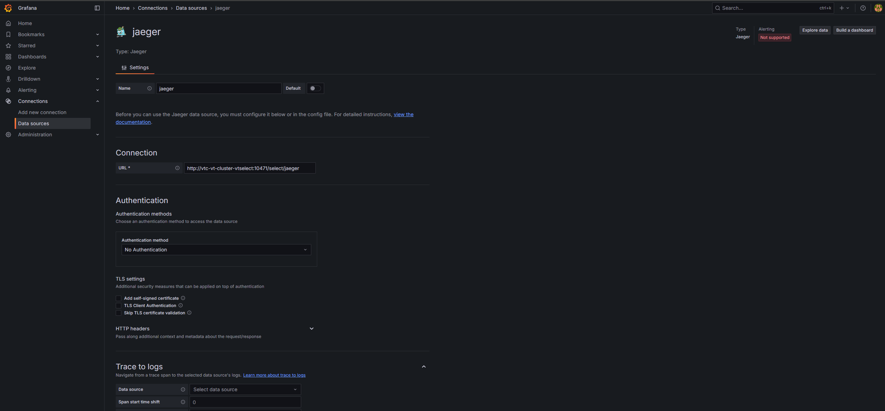
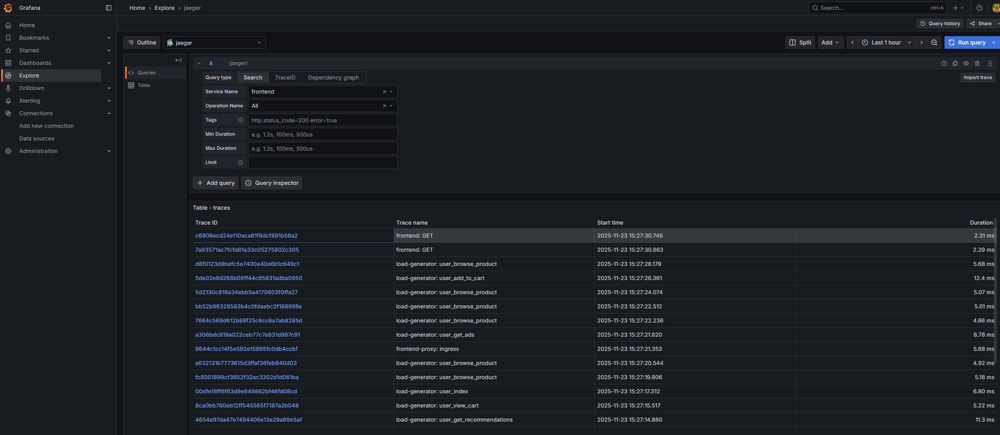
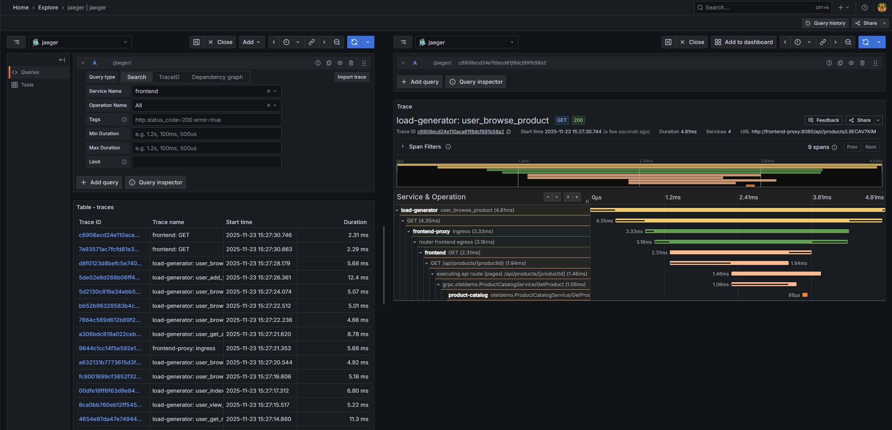

# VictoriaTraces: 高性能分布式追踪新方案

## 前言

在微服务架构日益复杂的今天,分布式追踪已成为可观测性的重要支柱。从监控请求在各个服务间的流转,到快速定位性能瓶颈,追踪系统扮演着不可或缺的角色。然而,传统的追踪解决方案往往面临资源消耗大、部署复杂、存储成本高等挑战。

**VictoriaTraces** 作为 VictoriaMetrics 家族的新成员,专为分布式追踪数据的存储和查询而设计。它延续了 VictoriaMetrics 在指标领域的卓越性能,将高效、简洁的理念带入了追踪领域,为构建统一的可观测性平台提供了完整的解决方案。

## 一、VictoriaTraces 核心特性

### 1.1 什么是 VictoriaTraces?

**VictoriaTraces** 是一款开源、用户友好的分布式追踪数据库,由 VictoriaMetrics 团队开发。它专为存储和查询分布式追踪数据而设计,目标是提供高性能、低成本的追踪解决方案。

**核心优势:**

- 💾 **资源高效** - 相比 Grafana Tempo,RAM 使用量减少高达 3.7 倍,CPU 使用量减少高达 2.6 倍
- ⚡ **线性扩展** - 性能随 CPU、RAM、磁盘 I/O 等资源线性增长,支持水平扩展到多节点集群
- 🚀 **零依赖** - 无需对象存储、ClickHouse 或 Elasticsearch 等外部依赖即可投入生产
- 🌐 **标准协议** - 原生支持 OpenTelemetry Protocol (OTLP) 接收追踪数据
- 📊 **完美集成** - 提供 Jaeger Query Service JSON API,无缝对接 Grafana 和 Jaeger 前端
- 🔔 **告警支持** - 内置告警功能,实现主动监控

### 1.2 技术架构设计

VictoriaTraces 采用了高效的存储架构:

```
┌─────────────────────────────────────┐
│       VictoriaTraces 单节点          │
│                                     │
│  ┌───────────────────────────┐     │
│  │  Trace Ingestion        │     │
│  │  - OTLP Protocol        │     │
│  │  - 实时数据流            │     │
│  │  - 自动解析              │     │
│  └───────────┬───────────────┘     │
│              ↓                      │
│  ┌───────────────────────────┐     │
│  │  Storage Engine         │     │
│  │  - 按天分区存储          │     │
│  │  - 高效压缩              │     │
│  │  - 自动合并              │     │
│  └───────────┬───────────────┘     │
│              ↓                      │
│  ┌───────────────────────────┐     │
│  │  Query Engine           │     │
│  │  - Jaeger Query API     │     │
│  │  - 并行查询              │     │
│  │  - 结果缓存              │     │
│  └───────────────────────────┘     │
└─────────────────────────────────────┘
```

**关键技术特点:**

1. **按天分区存储**
   - 每天的追踪数据存储在独立分区
   - 支持独立备份和恢复
   - 自动清理过期数据

2. **资源自适应**
   - 根据可用资源自动调优
   - 无需复杂的配置调整
   - 开箱即用的性能

3. **不可变数据文件**
   - 数据文件写入后不再修改
   - 定期合并优化存储
   - 保证数据一致性

4. **零外部依赖**
   - 无需配置对象存储(如 S3)
   - 无需外部数据库(如 ClickHouse)
   - 简化架构,降低运维复杂度

### 1.3 OpenTelemetry 原生支持

VictoriaTraces 完全拥抱 OpenTelemetry 生态:

**OTLP 协议支持:**
- ✅ **原生 OTLP** - 直接接收 OTLP 格式的追踪数据
- ✅ **无需转换** - 不需要额外的协议转换组件
- ✅ **高效传输** - 支持 gRPC 和 HTTP 传输协议
- ✅ **完整语义** - 保留 OpenTelemetry 的完整语义信息

**支持的数据类型:**
- Trace Spans - 追踪跨度
- Span Events - 跨度事件
- Span Links - 跨度链接
- Resource Attributes - 资源属性
- Span Attributes - 跨度属性

### 1.4 查询与可视化

#### **Jaeger Query API**

VictoriaTraces 实现了 Jaeger Query Service JSON API:

**功能特性:**
- 📊 **完全兼容** - 与 Jaeger 前端无缝集成
- 📊 **Grafana 支持** - 可作为 Grafana Tempo 数据源
- 📊 **标准查询** - 支持 Jaeger 的所有查询功能
- 📊 **高性能** - 优化的查询引擎,响应速度快

**查询能力:**
- 按服务名查询
- 按操作名查询
- 按标签过滤
- 时间范围筛选
- 追踪依赖关系分析

#### **Grafana 集成**

完美对接 Grafana 生态:

- 📈 **数据源支持** - 作为 Tempo 兼容数据源
- 📈 **Trace 可视化** - 在 Grafana 中查看完整追踪
- 📈 **关联查询** - 与 Logs 和 Metrics 关联分析
- 📈 **Dashboard 支持** - 构建追踪监控仪表盘

### 1.5 高可用架构

VictoriaTraces 支持多种高可用部署模式:

#### **单节点高可用**

**架构组件:**
- Trace Collector - 支持多路输出的采集器(如 OpenTelemetry Collector)
- 多个 VictoriaTraces 实例 - 2 个或更多实例作为副本
- vmauth/负载均衡器 - 用于读取负载均衡

**特点:**
- ✅ 数据冗余
- ✅ 读取负载均衡
- ✅ 单点故障恢复

#### **集群模式**

**扩展能力:**
- ✅ 水平扩展 - 支持多节点集群
- ✅ 数据分片 - 自动数据分布
- ✅ 线性性能 - 性能随节点数线性增长
- ✅ 高可用 - 节点故障自动恢复

### 1.6 数据保留与管理

VictoriaTraces 提供灵活的数据保留策略:

**时间保留:**
- 默认保留 7 天
- 可配置 1 天到 100 年
- 自动清理过期数据
- 支持未来时间戳数据(默认 2 天)

**磁盘空间保留:**

1. **绝对空间限制** - 设置固定的磁盘空间阈值
2. **百分比限制** - 基于文件系统总容量的动态阈值

**自动管理:**
- 按天分区自动删除
- 超过阈值触发清理
- 保留最近 2 天数据
- 增量删除,不影响性能

### 1.7 监控与告警

#### **Prometheus 指标暴露**

VictoriaTraces 在 http://<victoria-traces>:10428/metrics 暴露内部指标:

**关键指标:**
- vt_rows_dropped_total - 丢弃的 span 数量
- 存储使用情况
- 查询性能指标
- 摄入速率指标

**监控建议:**
- 使用 VictoriaMetrics 收集指标
- 使用 vmagent 作为采集代理
- 安装官方 Grafana Dashboard
- 通过 vmalert 配置告警

#### **内置告警**

支持主动监控:

- ✅ 丢弃数据告警 - 时间戳异常的 span
- ✅ 存储空间告警 - 磁盘使用率告警
- ✅ 性能告警 - 查询延迟告警
- ✅ 自定义告警 - 基于业务指标

### 1.8 备份与恢复

**备份特性:**

- 📦 **按天备份** - 独立的分区目录便于备份
- 📦 **增量备份** - 使用 rsync 进行增量同步
- 📦 **快照支持** - 支持磁盘快照备份
- 📦 **在线备份** - 无需停机即可备份

**恢复能力:**

- 🔄 **分区恢复** - 可恢复单个或多个分区
- 🔄 **热加载** - 恢复后自动发现新分区
- 🔄 **数据一致性** - 不可变文件保证一致性
- 🔄 **快速恢复** - rsync 增量传输,恢复迅速

## 二、VictoriaTraces 与 Grafana Tempo 对比

### 2.1 核心指标对比

| 对比维度 | Grafana Tempo | VictoriaTraces |
|---------|--------------|----------------|
| **资源消耗(RAM)** | 基准 | 减少 3.7 倍 |
| **资源消耗(CPU)** | 基准 | 减少 2.6 倍 |
| **存储依赖** | 需要对象存储 | 本地存储即可 |
| **外部依赖** | 可选 ClickHouse | 零依赖 |
| **部署复杂度** | 中等 | 简单 |
| **协议支持** | OTLP, Jaeger, Zipkin | OTLP (原生) |
| **查询 API** | Tempo API | Jaeger Query API |
| **扩展性** | 水平扩展 | 线性水平扩展 |
| **生态成熟度** | ⭐⭐⭐⭐ | ⭐⭐⭐ |

### 2.2 架构对比

#### **Grafana Tempo 架构**

**组件:**
- Distributor - 数据分发
- Ingester - 数据摄入和缓存
- Compactor - 数据压缩合并
- Querier - 查询服务
- Query Frontend - 查询前端

**存储:**
- 必需对象存储(S3, GCS, Azure Blob)
- 可选使用 ClickHouse 加速查询

**特点:**
- 🔸 组件较多,部署复杂
- 🔸 强依赖对象存储
- 🔸 需要配置多个组件

#### **VictoriaTraces 架构**

**组件:**
- 单一进程包含所有功能
- 可选集群模式

**存储:**
- 本地磁盘存储
- 可选对象存储(但非必需)

**特点:**
- ✅ 单进程架构,部署简单
- ✅ 本地存储即可工作
- ✅ 零配置启动

### 2.3 性能对比

**资源效率:**

| 指标 | Grafana Tempo | VictoriaTraces | 优势 |
|------|--------------|----------------|------|
| **RAM 使用** | 基准 | -73% | 3.7x 更少 |
| **CPU 使用** | 基准 | -62% | 2.6x 更少 |
| **存储效率** | 压缩 | 高效压缩 | 更优 |
| **查询延迟** | 毫秒级 | 毫秒级 | 相当 |

**测试场景说明:**
- 相同的追踪数据量
- 相同的查询负载
- 相同的硬件配置

### 2.4 功能对比

#### **数据摄入**

| 功能 | Grafana Tempo | VictoriaTraces |
|------|--------------|----------------|
| **OTLP 支持** | ✅ | ✅ 原生 |
| **Jaeger 协议** | ✅ | 🔄 转换为 OTLP |
| **Zipkin 协议** | ✅ | 🔄 转换为 OTLP |
| **采样支持** | ✅ | ✅ |

#### **查询能力**

| 功能 | Grafana Tempo | VictoriaTraces |
|------|--------------|----------------|
| **TraceQL** | ✅ 原生 | ❌ |
| **Jaeger Query API** | ✅ 兼容 | ✅ 原生 |
| **Grafana 集成** | ✅ 深度 | ✅ 兼容 |
| **标签查询** | ✅ | ✅ |
| **全文搜索** | 有限 | 有限 |

#### **高级功能**

| 功能 | Grafana Tempo | VictoriaTraces |
|------|--------------|----------------|
| **多租户** | ✅ | 开发中 |
| **数据压缩** | ✅ | ✅ |
| **自动清理** | ✅ | ✅ |
| **告警** | 需 vmalert | ✅ 内置 |
| **备份** | 对象存储 | rsync/快照 |

### 2.5 成本对比

**典型场景:** 100GB/天追踪数据,保留 30 天

**Grafana Tempo 成本:**
- 对象存储: S3 标准存储 ~$70/月
- 计算资源: 3 个实例 ~$300/月
- ClickHouse(可选): ~$200/月
- **总成本: $370-570/月**

**VictoriaTraces 成本:**
- 本地存储: 本地磁盘 ~$20/月
- 计算资源: 1 个实例 ~$100/月
- 无外部依赖: $0
- **总成本: $120/月**

**成本节省: ~70-80%**

### 2.6 技术选型建议

**选择 VictoriaTraces 如果:**

- 🎯 对成本敏感,需要降低运营成本
- 🎯 希望简化部署,减少组件依赖
- 🎯 已使用 VictoriaMetrics,构建统一可观测性平台
- 🎯 不需要 TraceQL,Jaeger Query API 即可满足
- 🎯 资源有限,需要高效的资源利用
- 🎯 需要零外部依赖的生产就绪方案

**选择 Grafana Tempo 如果:**

- 🎯 深度使用 Grafana 生态
- 🎯 需要 TraceQL 强大的查询能力
- 🎯 已有对象存储基础设施
- 🎯 需要成熟的多租户功能
- 🎯 团队熟悉 Tempo 生态
- 🎯 生态成熟度是首要考虑因素

## 三、统一可观测性平台

### 3.1 VictoriaMetrics 生态闭环

VictoriaTraces 作为 VictoriaMetrics 家族的一员,完善了可观测性三大支柱:

```
┌──────────────────────────────────────────┐
│      VictoriaMetrics 可观测性生态        │
│                                          │
│  ┌────────────┐  ┌────────────┐         │
│  │ Metrics    │  │ Logs       │         │
│  │ Victoria   │  │ Victoria   │         │
│  │ Metrics    │  │ Logs       │         │
│  └────────────┘  └────────────┘         │
│         ↓               ↓                │
│  ┌──────────────────────────────┐       │
│  │     Traces                    │       │
│  │     VictoriaTraces           │       │
│  └──────────────────────────────┘       │
│                ↓                         │
│  ┌──────────────────────────────┐       │
│  │     Unified Observability     │       │
│  │     - Grafana 可视化          │       │
│  │     - 关联分析                │       │
│  │     - 统一告警                │       │
│  └──────────────────────────────┘       │
└──────────────────────────────────────────┘
```

**生态优势:**

- 📊 **统一架构** - 相似的设计理念和操作方式
- 📊 **资源共享** - 共享监控、告警基础设施
- 📊 **关联分析** - Metrics、Logs、Traces 三者关联
- 📊 **成本优化** - 统一的资源优化策略

### 3.2 与 VictoriaLogs 协同

**日志与追踪关联:**

- 🔗 **TraceID 关联** - 通过 TraceID 关联日志和追踪
- 🔗 **上下文跳转** - 从追踪跳转到相关日志
- 🔗 **统一时间线** - 在时间维度上对齐分析
- 🔗 **根因分析** - 快速定位问题根源

**协同优势:**

- ✅ 单一供应商,简化采购
- ✅ 统一学习曲线
- ✅ 一致的操作体验
- ✅ 更低的总拥有成本


## 四、VictoriaTraces 部署实战

### 4.1 部署单机模式 VictoriaTraces
```
# 添加仓库，如果已添加请忽略
helm repo add vm https://victoriametrics.github.io/helm-charts/

export RETENTION=30d
export PVC_SIZE=10Gi
export NAMESPACE=victoriametrics

kubectl create namespace $NAMESPACE

# Install victoria-traces-single chart
helm install vts vm/victoria-traces-single --namespace $NAMESPACE --wait \
    --set "server.retentionPeriod=$RETENTION" --set "server.persistentVolume.size=$PVC_SIZE"
```
### 4.2 部署集群模式 VictoriaTraces
```
export RETENTION=30d
export PVC_SIZE=10Gi
export VTSTORAGE_REPLICAS=2
export NAMESPACE=victoriametrics

# Install victoria-traces-cluster chart
helm install vtc vm/victoria-traces-cluster --namespace $NAMESPACE --wait \
    --set "vtstorage.retentionPeriod=$RETENTION" --set "vtstorage.persistentVolume.size=$PVC_SIZE" \
    --set vmauth.enabled=true \
    --set vtstorage.replicaCount=$VTSTORAGE_REPLICAS
[root@master ~]# kubectl get pod -n victoriametrics
NAME                                                        READY   STATUS    RESTARTS       AGE
vtc-vt-cluster-vmauth-54b54576f4-jdfbv                      1/1     Running   0              50s
vtc-vt-cluster-vmauth-54b54576f4-s6wlt                      1/1     Running   0              50s
vtc-vt-cluster-vtinsert-7f85c9cc7-prwlr                     1/1     Running   0              50s
vtc-vt-cluster-vtinsert-7f85c9cc7-q4gvv                     1/1     Running   0              50s
vtc-vt-cluster-vtselect-75cf9b5b44-7vhzv                    1/1     Running   0              50s
vtc-vt-cluster-vtselect-75cf9b5b44-qkrqd                    1/1     Running   0              50s
vtc-vt-cluster-vtstorage-0                                  1/1     Running   0              50s
vtc-vt-cluster-vtstorage-1                                  1/1     Running   0              20s

```
### 4.3 部署 Demo 应用
```
[root@master ~]# helm install my-otel-demo open-telemetry/opentelemetry-demo
level=WARN msg="unable to find exact version; falling back to closest available version" chart=opentelemetry-demo requested="" selected=0.38.6
NAME: my-otel-demo
LAST DEPLOYED: Sun Nov 23 15:06:11 2025
NAMESPACE: default
STATUS: deployed
REVISION: 1
DESCRIPTION: Install complete
TEST SUITE: None
NOTES:
=======================================================================================


 ██████╗ ████████╗███████╗██╗         ██████╗ ███████╗███╗   ███╗ ██████╗
██╔═══██╗╚══██╔══╝██╔════╝██║         ██╔══██╗██╔════╝████╗ ████║██╔═══██╗
██║   ██║   ██║   █████╗  ██║         ██║  ██║█████╗  ██╔████╔██║██║   ██║
██║   ██║   ██║   ██╔══╝  ██║         ██║  ██║██╔══╝  ██║╚██╔╝██║██║   ██║
╚██████╔╝   ██║   ███████╗███████╗    ██████╔╝███████╗██║ ╚═╝ ██║╚██████╔╝
 ╚═════╝    ╚═╝   ╚══════╝╚══════╝    ╚═════╝ ╚══════╝╚═╝     ╚═╝ ╚═════╝


- All services are available via the Frontend proxy: http://localhost:8080
  by running these commands:
     kubectl --namespace default port-forward svc/frontend-proxy 8080:8080

  The following services are available at these paths after the frontend-proxy service is exposed with port forwarding:
  Webstore             http://localhost:8080/
  Jaeger UI            http://localhost:8080/jaeger/ui/
  Grafana              http://localhost:8080/grafana/
  Load Generator UI    http://localhost:8080/loadgen/
  Feature Flags UI     http://localhost:8080/feature/
[root@master ~]# kubectl get pod 
NAME                                         READY   STATUS    RESTARTS        AGE
accounting-6c8fcd898c-k89tt                  1/1     Running   0               5m28s
ad-6b4c9b6549-dmhj4                          1/1     Running   0               5m28s
cart-5b85789df-8zskm                         1/1     Running   0               5m30s
checkout-75ff8fc86f-vwpcv                    1/1     Running   0               5m30s
currency-59c9c5b557-fgnll                    1/1     Running   0               5m30s
email-979476c59-2d7v9                        1/1     Running   0               5m30s
flagd-6788d758ff-zgf6l                       2/2     Running   0               5m30s
fraud-detection-74c7757879-4dsqq             1/1     Running   0               5m29s
frontend-5c4cfb58d7-72qht                    1/1     Running   0               5m29s
frontend-proxy-6bb94d786f-psn2w              1/1     Running   0               5m30s
grafana-75d59cdff4-r5lzm                     4/4     Running   1 (3m25s ago)   5m30s
image-provider-687cd466bf-dkdh5              1/1     Running   0               5m29s
jaeger-8556cdf449-pbnn6                      1/1     Running   0               5m30s
kafka-6f596699d7-hqjb8                       1/1     Running   0               5m29s
load-generator-7d75dd5fb4-vhhch              1/1     Running   0               5m29s
my-opentelemetry-operator-7b8f564c48-d4dg4   2/2     Running   0               12m
opensearch-0                                 1/1     Running   0               5m30s
otel-collector-6974c55844-s4m2r              1/1     Running   0               5m30s
payment-5c46d9d5-9kff8                       1/1     Running   0               5m28s
postgresql-9f8cff57f-gkglj                   1/1     Running   0               5m28s
product-catalog-589bcf4889-lrsqd             1/1     Running   0               5m30s
prometheus-7d7bc46676-8bd4f                  1/1     Running   0               5m30s
quote-648c98fdcd-zdp6v                       1/1     Running   0               5m28s
recommendation-6888db4747-2bn9w              1/1     Running   0               5m27s
shipping-6cd45944d5-m4rmz                    1/1     Running   0               5m28s
valkey-cart-7845fbb7d6-svxx2                 1/1     Running   0               5m27s
```
### 4.4 配置 Collector

修改 OpenTelemetry Collector 配置,添加 VictoriaTraces 作为导出目标:

```bash
kubectl edit cm otel-collector
      6 data:     
      7   relay: |
      8     connectors:
      9       spanmetrics: {}
     10     exporters:
     11       debug: {}
     12       opensearch:
     13         http:
     14           endpoint: http://opensearch:9200
     15           tls:
     16             insecure: true
     17         logs_index: otel-logs
     18         logs_index_time_format: yyyy-MM-dd
     19       otlp: 
     20         endpoint: jaeger-collector:4317
     21         tls:
     22           insecure: true
     23       otlphttp: # 新增
     24         traces_endpoint: http://vtc-vt-cluster-vtinsert.victoriametrics:10481/insert/opentelemetry/v1/traces # 新增


    172         traces:
    173           exporters:
    174           - otlphttp #新增
    175           - otlp
    176           - debug
    177           - spanmetrics
```

重启 Collector 使配置生效:

```bash
# 重启 Collector(根据你的环境找到 Collector 的 namespace 和 pod 名称)
kubectl delete pod otel-collector-6974c55844-s4m2r -n default
```

### 4.5 访问 Demo 应用

启动端口转发访问 Demo 应用:

```bash
kubectl --namespace default port-forward --address 0.0.0.0 svc/frontend-proxy 8080:8080
```

访问 http://localhost:8080,看到以下界面代表部署成功,可以随意点击功能产生追踪数据:


### 4.6 在 Grafana 中查看追踪链路

#### 添加 Jaeger 数据源

在 Grafana 中添加 Jaeger 数据源,配置 VictoriaTraces 的查询端点:



#### 查询追踪数据

Service Name 选择 `frontend`,查看服务的追踪数据:



#### 查看追踪详情

点击 TraceID 可以查看完整的追踪链路:



## 五、总结

VictoriaTraces 作为分布式追踪的新选择,在性能、成本和易用性上都展现出显著优势:

### 5.1 核心优势

✅ **性能卓越** - RAM 使用减少 3.7 倍,CPU 使用减少 2.6 倍  
✅ **零依赖架构** - 无需对象存储等外部依赖即可生产就绪  
✅ **成本极低** - 相比 Tempo 节省 70-80% 成本  
✅ **部署简单** - 单一可执行文件,零配置启动  
✅ **完美集成** - Jaeger Query API,无缝对接 Grafana  
✅ **生态协同** - 与 VictoriaMetrics、VictoriaLogs 构建统一可观测性平台  

### 5.2 适用场景

**VictoriaTraces 特别适合:**

- 🎯 **成本优化场景** - 需要降低追踪存储和计算成本
- 🎯 **简化架构** - 希望减少组件依赖,简化运维
- 🎯 **统一可观测性** - 已使用 VictoriaMetrics 生态
- 🎯 **资源受限环境** - 需要高效的资源利用
- 🎯 **快速部署** - 需要快速搭建追踪系统
- 🎯 **中小规模** - 追踪数据量适中的场景

### 5.3 下期预告

在下一篇文章中,我们将深入介绍:

- 🔧 **cert-manager** - Kubernetes 证书管理的最佳实践
- 🔧 **OpenTelemetry Operator** - 自动化可观测性数据采集
- 🔧 **OpenTelemetry Collector** - 统一的遥测数据管道
- 🔧 **自动注入** - 零代码改造实现应用可观测性
- 🔧 **最佳实践** - 生产环境的配置优化建议

### 5.4 参考资源

- VictoriaTraces 官方文档: https://docs.victoriametrics.com/victoriatraces/
- VictoriaTraces GitHub: https://github.com/VictoriaMetrics/VictoriaTraces
- OpenTelemetry 协议: https://opentelemetry.io/docs/specs/otlp/
- Jaeger Query API: https://www.jaegertracing.io/docs/latest/apis/
- VictoriaMetrics 官网: https://victoriametrics.com/

---

**说明:** 本文涵盖了 VictoriaTraces 的核心特性介绍、与 Grafana Tempo 的对比分析,以及完整的单机和集群部署实战。通过本文,你可以快速了解并上手 VictoriaTraces,构建高性能的分布式追踪系统。
