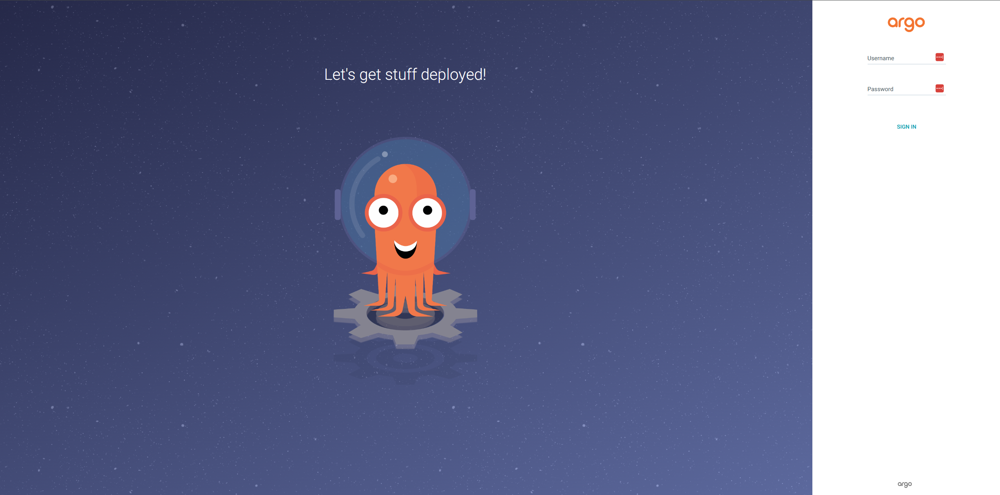
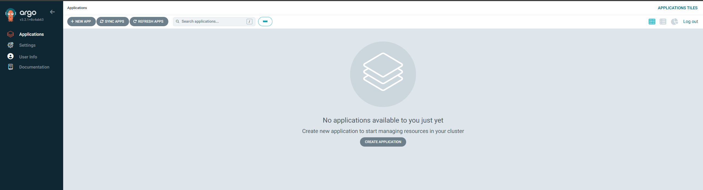
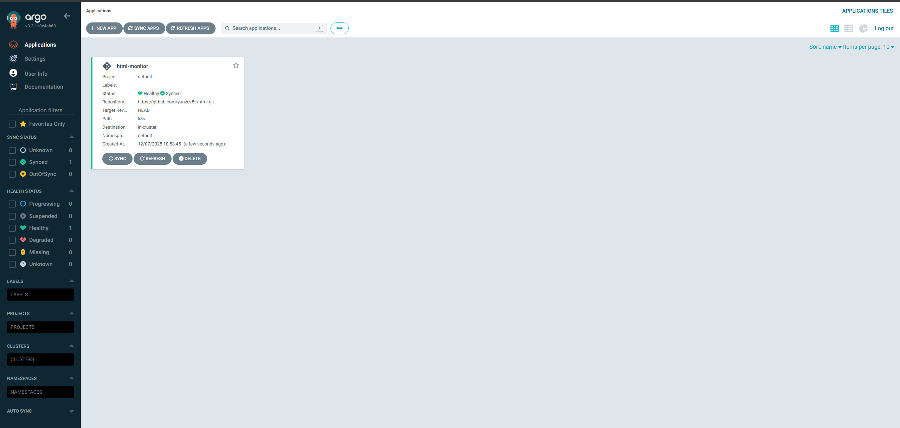
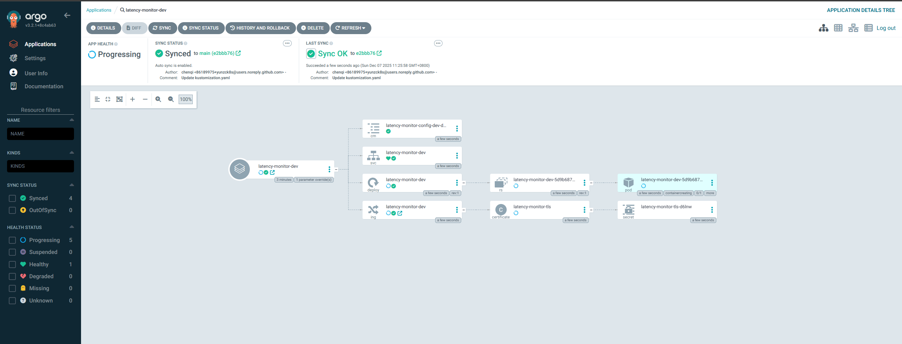

# 告别手动部署-GitHub Actions+ArgoCD自动化交付实践

## 前言

你是否还在手动构建镜像、手动推送到仓库、手动更新 Kubernetes YAML、手动执行 kubectl apply？这种传统的部署方式不仅效率低下，还容易出错。一旦团队规模扩大，这种手动操作会成为开发效率的最大瓶颈。

今天，我将为你带来一套完整的自动化交付方案：**GitHub Actions + ArgoCD**，实现从代码提交到生产部署的自动化流程，大幅提升部署效率。

## 一、为什么选择这套方案？

### 1.1 传统部署的痛点

- **效率低下**：每次发布都要手动执行一堆命令
- **容易出错**：人工操作难免遗漏步骤或配置错误
- **无法追溯**：部署记录散落在各处，难以审计
- **协作困难**：多人协作时容易相互覆盖配置
- **回滚麻烦**：出问题时回滚流程复杂

### 1.2 GitOps 方案的优势

| 维度 | 传统部署 | GitOps 方案 |
|------|---------|------------|
| 部署方式 | kubectl apply 手动执行 | Git push 自动触发 |
| 配置管理 | 散落在各处 | 统一存储在 Git |
| 变更追溯 | 难以追踪 | Git 历史完整记录 |
| 回滚能力 | 需要手动操作 | Git revert 即可回滚 |
| 安全审计 | 难以审计 | Git 提供完整审计日志 |
| 协作模式 | 容易冲突 | Git 分支模型成熟 |
| 声明式 | 命令式操作 | 完全声明式 |

### 1.3 技术栈选型

**GitHub Actions**：CI 阶段
- ✅ GitHub 原生集成，零配置成本
- ✅ 丰富的 Actions 市场
- ✅ 免费额度充足（公开仓库无限制）
- ✅ 支持多种触发器

**ArgoCD**：CD 阶段
- ✅ CNCF 孵化项目，生产级稳定性
- ✅ 声明式 GitOps 理念
- ✅ 强大的 Web UI
- ✅ 自动同步与健康检查

## 二、架构设计

### 2.1 整体流程

```
┌─────────────────────────────────────────────────────────────────┐
│                     开发者推送代码到 GitHub                        │
└──────────────────────────┬──────────────────────────────────────┘
                           │
                           ▼
┌─────────────────────────────────────────────────────────────────┐
│  GitHub Actions (CI)                                             │
│  1. 代码检出                                                      │
│  2. 构建 Docker 镜像                                             │
│  3. 推送镜像到 Docker Hub (带新 tag)                              │
│  4. 更新 Git 仓库中的镜像标签                                      │
└──────────────────────────┬──────────────────────────────────────┘
                           │
                           ▼
┌─────────────────────────────────────────────────────────────────┐
│  ArgoCD (CD)                                                     │
│  1. 检测到 Git 仓库变更                                            │
│  2. 自动同步到 Kubernetes 集群                                     │
│  3. 滚动更新应用                                                   │
└─────────────────────────────────────────────────────────────────┘
```

### 2.2 关键设计点

1. **职责分离**：CI 负责构建镜像和更新 Git，CD 负责部署
2. **Git 为中心**：所有配置变更都通过 Git 追溯
3. **自动化流程**：从代码到部署减少人工干预
4. **安全可靠**：使用 Secret 管理敏感信息，支持回滚

## 三、环境准备

### 3.1 前置条件

- ✅ Kubernetes 集群（1.20+）
- ✅ kubectl 命令行工具
- ✅ GitHub 账号
- ✅ Docker Hub 账号（或其他镜像仓库）
- ✅ 已部署 Higress Ingress（参考我之前的文章）

### 3.2 项目准备

我们使用这个示例项目：`https://github.com/yunzck8s/html`

这是一个域名延迟监控工具，具有以下特点：
- 纯前端项目（HTML/CSS/JS）
- 已包含 Dockerfile
- 适合演示自动化部署

## 四、ArgoCD 部署

### 4.1 安装 ArgoCD

**1. 创建命名空间并安装**

```bash
# 创建 ArgoCD 命名空间
kubectl create namespace argocd

# 安装 ArgoCD
kubectl apply -n argocd -f https://raw.githubusercontent.com/argoproj/argo-cd/stable/manifests/install.yaml

# 等待所有 Pod 就绪
kubectl wait --for=condition=Ready pods --all -n argocd --timeout=300s
```

**2. 验证安装**

```bash
kubectl get pods -n argocd
```

预期输出：
```
NAME                                                READY   STATUS    RESTARTS   AGE
argocd-application-controller-0                     1/1     Running   0          66s
argocd-applicationset-controller-5c9b95498b-x8j8t   1/1     Running   0          66s
argocd-dex-server-cccc8f49d-gmp77                   1/1     Running   0          66s
argocd-notifications-controller-576c4d5559-ff4tb    1/1     Running   0          66s
argocd-redis-684497594f-j5qc7                       1/1     Running   0          66s
argocd-repo-server-6c857c79ff-tvptx                 1/1     Running   0          66s
argocd-server-9dc66fd74-599hh                       1/1     Running   0          66s
```

### 4.2 配置访问

**方式一：使用 Higress Ingress（推荐）**

创建 `argocd-ingress.yaml`：

```yaml
apiVersion: networking.k8s.io/v1
kind: Ingress
metadata:
  name: argocd-server-ingress
  namespace: argocd
  annotations:
    kubernetes.io/ingress.class: higress
    higress.io/backend-protocol: HTTPS
    higress.io/ssl-redirect: "true"
spec:
  rules:
  - host: argocd.example.com  # 替换为你的域名
    http:
      paths:
      - path: /
        pathType: Prefix
        backend:
          service:
            name: argocd-server
            port:
              number: 443
```

应用配置：
```bash
kubectl apply -f argocd-ingress.yaml
```

**方式二：端口转发（测试环境）**

```bash
kubectl port-forward svc/argocd-server -n argocd 8080:443
```

### 4.3 获取初始密码

```bash
# 获取初始管理员密码
kubectl -n argocd get secret argocd-initial-admin-secret -o jsonpath="{.data.password}" | base64 -d; echo
```

### 4.4 登录 ArgoCD

**Web UI 登录**：
1. 访问 `https://argocd.example.com`
2. 用户名：`admin`
3. 密码：上一步获取的密码

**CLI 登录**（可选）：

```bash
# 安装 ArgoCD CLI
curl -sSL -o /usr/local/bin/argocd https://github.com/argoproj/argo-cd/releases/latest/download/argocd-linux-amd64
chmod +x /usr/local/bin/argocd

# 登录
argocd login argocd.example.com --username admin --password <密码>

# 修改密码
argocd account update-password
```

**安全提示**：修改密码后删除初始密码 Secret

```bash
kubectl -n argocd delete secret argocd-initial-admin-secret
```

## 五、准备 Kubernetes 部署清单

### 5.1 Fork 示例项目

1. Fork `https://github.com/yunzck8s/html` 到你的账号
2. 克隆到本地

```bash
git clone https://github.com/<your-username>/html.git
cd html
```

### 5.2 创建 Kubernetes 部署清单

在项目根目录创建 `k8s` 目录并添加部署文件:

```bash
mkdir -p k8s
```

**创建 `k8s/deployment.yaml`**:

```yaml
apiVersion: apps/v1
kind: Deployment
metadata:
  name: html-monitor
  labels:
    app: html-monitor
spec:
  replicas: 2
  selector:
    matchLabels:
      app: html-monitor
  template:
    metadata:
      labels:
        app: html-monitor
    spec:
      containers:
      - name: html-monitor
        image: <your-dockerhub-username>/html:latest
        ports:
        - containerPort: 80
        resources:
          requests:
            cpu: 100m
            memory: 128Mi
          limits:
            cpu: 200m
            memory: 256Mi
```

**创建 `k8s/service.yaml`**:

```yaml
apiVersion: v1
kind: Service
metadata:
  name: html-monitor
spec:
  selector:
    app: html-monitor
  ports:
  - protocol: TCP
    port: 80
    targetPort: 80
  type: ClusterIP
```

**创建 `k8s/ingress.yaml`**:

```yaml
apiVersion: networking.k8s.io/v1
kind: Ingress
metadata:
  name: html-monitor
  annotations:
    kubernetes.io/ingress.class: higress
spec:
  rules:
  - host: monitor.example.com  # 替换为你的域名
    http:
      paths:
      - path: /
        pathType: Prefix
        backend:
          service:
            name: html-monitor
            port:
              number: 80
```

**提交文件到 Git**:

```bash
git add k8s/
git commit -m "Add Kubernetes manifests"
git push origin main
```

## 六、配置 GitHub Actions

### 6.1 创建 Docker Hub 仓库

1. 登录 [Docker Hub](https://hub.docker.com/)
2. 创建新仓库，命名为 `html`
3. 记录你的 Docker Hub 用户名

### 6.2 配置 GitHub Secrets

在你的 GitHub 仓库中配置以下 Secrets:

1. 进入 **Settings** → **Secrets and variables** → **Actions**
2. 添加以下 Secrets:

| Secret 名称 | 说明 | 示例值 |
|------------|------|--------|
| `DOCKER_USERNAME` | Docker Hub 用户名 | `yourname` |
| `DOCKER_PASSWORD` | Docker Hub 密码或 Token | `dckr_pat_xxxxx` |
| `GH_PAT` | GitHub Personal Access Token | `ghp_xxxxx` |

**创建 GitHub PAT**:
1. 访问 **Settings** → **Developer settings** → **Personal access tokens** → **Tokens (classic)**
2. 点击 **Generate new token (classic)**
3. 勾选以下权限:
   - `repo` (完整仓库访问权限)
   - `workflow` (工作流权限)
4. 生成并保存 Token

### 6.3 创建 GitHub Actions Workflow

创建 `.github/workflows/ci.yaml`:

```yaml
name: CI/CD Pipeline

on:
  push:
    branches:
      - main
  pull_request:
    branches:
      - main

jobs:
  build-and-push:
    runs-on: ubuntu-latest
    steps:
    - name: Checkout code
      uses: actions/checkout@v3
      with:
        token: ${{ secrets.GH_PAT }}

    - name: Set up Docker Buildx
      uses: docker/setup-buildx-action@v2

    - name: Login to Docker Hub
      uses: docker/login-action@v2
      with:
        username: ${{ secrets.DOCKER_USERNAME }}
        password: ${{ secrets.DOCKER_PASSWORD }}

    - name: Generate image tag
      id: tag
      run: |
        IMAGE_TAG=$(echo $GITHUB_SHA | cut -c1-7)
        echo "IMAGE_TAG=$IMAGE_TAG" >> $GITHUB_OUTPUT
        echo "Generated tag: $IMAGE_TAG"

    - name: Build and push Docker image
      uses: docker/build-push-action@v4
      with:
        context: .
        push: true
        tags: |
          ${{ secrets.DOCKER_USERNAME }}/html:${{ steps.tag.outputs.IMAGE_TAG }}
          ${{ secrets.DOCKER_USERNAME }}/html:latest
        cache-from: type=registry,ref=${{ secrets.DOCKER_USERNAME }}/html:latest
        cache-to: type=inline

    - name: Update Kubernetes manifests
      run: |
        sed -i "s|image:.*|image: ${{ secrets.DOCKER_USERNAME }}/html:${{ steps.tag.outputs.IMAGE_TAG }}|g" k8s/deployment.yaml
        cat k8s/deployment.yaml

    - name: Commit and push changes
      run: |
        git config user.name "GitHub Actions"
        git config user.email "actions@github.com"
        git add k8s/deployment.yaml
        git diff --staged --quiet || git commit -m "Update image to ${{ steps.tag.outputs.IMAGE_TAG }}"
        git push
```

**关键配置说明**:

- `on.push.branches`: 触发条件为推送到 main 分支
- `checkout@v3`: 使用 GH_PAT 检出代码,确保后续可以推送
- `docker/build-push-action@v4`: 构建并推送镜像
- `sed`: 更新 deployment.yaml 中的镜像标签
- `git push`: 将更新后的清单推送回仓库

### 6.4 提交 Workflow

```bash
git add .github/workflows/ci.yaml
git commit -m "Add GitHub Actions workflow"
git push origin main
```

### 6.5 验证 Workflow

1. 访问 GitHub 仓库的 **Actions** 标签页
2. 应该看到 "CI/CD Pipeline" 工作流正在运行
3. 等待构建完成(通常 2-3 分钟)
4. 检查 Docker Hub,确认镜像已推送成功

## 七、创建 ArgoCD Application

### 7.1 创建 Application YAML

创建 `argocd-app.yaml`：

```yaml
apiVersion: argoproj.io/v1alpha1
kind: Application
metadata:
  name: html-monitor
  namespace: argocd
spec:
  project: default
  source:
    repoURL: https://github.com/<your-username>/html.git
    targetRevision: HEAD
    path: k8s
  destination:
    server: https://kubernetes.default.svc
    namespace: default
  syncPolicy:
    automated:
      prune: true
      selfHeal: true
      allowEmpty: false
    syncOptions:
    - CreateNamespace=true
```

**关键配置说明**：

- `repoURL`：你的 Git 仓库地址
- `path`：Kubernetes 清单文件路径
- `automated`：启用自动同步
- `prune: true`：自动删除 Git 中已移除的资源
- `selfHeal: true`：自动修复偏差

### 7.2 应用 Application

```bash
kubectl apply -f argocd-app.yaml
```

### 7.3 查看应用状态

**Web UI**：
访问 ArgoCD Web UI，可以看到 `html-monitor` 应用，状态应该为 `Synced` 和 `Healthy`。

**CLI**：
```bash
argocd app get html-monitor
argocd app sync html-monitor  # 手动同步
```

## 八、完整流程验证

### 8.1 触发自动化流程

**1. 修改代码**

编辑 `index.html`，做一些改动：

```bash
# 修改文件
vim index.html

# 提交变更
git add index.html
git commit -m "Update: improve UI design"
git push origin main
```

**2. 观察 GitHub Actions**

访问 GitHub Actions 页面，查看构建进度：
- ✅ Checkout code
- ✅ Build Docker image
- ✅ Push to Docker Hub
- ✅ Update Kubernetes manifests
- ✅ Commit and push changes

**3. 验证 Git 提交**

检查你的 GitHub 仓库，应该看到 GitHub Actions 自动提交的更新：

```
commit xxxxx
Author: GitHub Actions
Date: ...

Update image to abc1234
```

**4. 观察 ArgoCD 同步**

在 ArgoCD Web UI 中：
- Application 状态变为 `OutOfSync`
- 自动触发同步
- 状态变为 `Syncing` → `Synced`
- Pod 滚动更新完成

**5. 验证部署**

```bash
# 查看 Pod 镜像版本
kubectl get pods -n default -l app=html-monitor -o jsonpath='{.items[*].spec.containers[*].image}'

# 应该显示新的镜像标签
<username>/html:abc1234
```

访问 `http://monitor.example.com`，确认新版本已部署成功。

### 8.2 完整流程时间线

```
00:00 - 开发者推送代码到 GitHub
00:01 - GitHub Actions 触发构建
00:03 - 镜像构建完成并推送到 Docker Hub
00:04 - GitHub Actions 更新 deployment.yaml 并提交
00:05 - ArgoCD 检测到 Git 变更
00:06 - ArgoCD 自动同步到 Kubernetes 集群
00:08 - Pod 滚动更新完成，新版本上线
```

**总耗时**：约 8 分钟（自动化，减少人工干预）

## 九、高级配置

### 9.1 多环境部署

创建不同的 Application 对应不同环境：

**开发环境**：
```yaml
apiVersion: argoproj.io/v1alpha1
kind: Application
metadata:
  name: html-monitor-dev
  namespace: argocd
spec:
  source:
    repoURL: https://github.com/<your-username>/html.git
    path: k8s/overlays/dev
    targetRevision: develop
  destination:
    namespace: dev
  syncPolicy:
    automated:
      prune: true
      selfHeal: true
```

**生产环境**：
```yaml
apiVersion: argoproj.io/v1alpha1
kind: Application
metadata:
  name: html-monitor-prod
  namespace: argocd
spec:
  source:
    repoURL: https://github.com/<your-username>/html.git
    path: k8s/overlays/prod
    targetRevision: main
  destination:
    namespace: prod
  syncPolicy:
    automated:
      prune: true
      selfHeal: false  # 生产环境建议手动批准
```

### 9.2 配置 Slack 通知

安装 ArgoCD Notifications：

```bash
kubectl apply -n argocd -f https://raw.githubusercontent.com/argoproj/argo-cd/stable/notifications_catalog/install.yaml
```

配置 Slack Webhook：

```bash
kubectl edit configmap argocd-notifications-cm -n argocd
```

添加：

```yaml
data:
  service.slack: |
    token: $slack-token
  trigger.on-deployed: |
    - when: app.status.operationState.phase in ['Succeeded']
      send: [app-deployed]
  template.app-deployed: |
    message: |
      Application {{.app.metadata.name}} has been deployed!
      Version: {{.app.status.sync.revision}}
    slack:
      attachments: |
        [{
          "title": "{{ .app.metadata.name}}",
          "color": "good"
        }]
```

### 9.3 配置同步策略

**自动同步配置**：

```yaml
syncPolicy:
  automated:
    prune: true      # 自动删除不在 Git 中的资源
    selfHeal: true   # 自动修复手动修改
  syncOptions:
  - CreateNamespace=true  # 自动创建命名空间
  - PruneLast=true        # 最后删除资源
  retry:
    limit: 5
    backoff:
      duration: 5s
      factor: 2
      maxDuration: 3m
```

### 9.4 使用 Kustomize

ArgoCD 原生支持 Kustomize，可以更好地管理多环境配置：

**目录结构**：
```
k8s/
├── base/
│   ├── deployment.yaml
│   ├── service.yaml
│   ├── ingress.yaml
│   └── kustomization.yaml
└── overlays/
    ├── dev/
    │   └── kustomization.yaml
    └── prod/
        └── kustomization.yaml
```

**base/kustomization.yaml**：
```yaml
apiVersion: kustomize.config.k8s.io/v1beta1
kind: Kustomization
resources:
- deployment.yaml
- service.yaml
- ingress.yaml
```

**overlays/prod/kustomization.yaml**：
```yaml
apiVersion: kustomize.config.k8s.io/v1beta1
kind: Kustomization
bases:
- ../../base
replicas:
- name: html-monitor
  count: 3
images:
- name: html-monitor
  newTag: v1.0.0
```

## 十、性能优化

### 10.1 ArgoCD 性能调优

```bash
# 增加 controller 副本数
kubectl scale statefulset argocd-application-controller -n argocd --replicas=3

# 增加 repo-server 副本数
kubectl scale deployment argocd-repo-server -n argocd --replicas=2
```

### 10.2 减少 Git 轮询频率

```bash
kubectl edit configmap argocd-cm -n argocd
```

添加：
```yaml
data:
  timeout.reconciliation: 180s  # 3 分钟检查一次
```

### 10.3 缓存优化

```yaml
data:
  repository.credentials: |
    - url: https://github.com/<your-org>
      cache:
        enabled: true
        expiration: 24h
```

## 十一、对比传统方案

| 维度 | 传统部署 | GitHub Actions + ArgoCD |
|------|----------|------------------------|
| **部署速度** | 5-10 分钟（手动） | 8 分钟（自动化） |
| **人工介入** | 每次都需要 | 大幅减少 |
| **出错率** | 约 5-10% | < 1% |
| **可追溯性** | 难以追溯 | Git 完整记录 |
| **回滚时间** | 10-30 分钟 | 1 分钟（Git revert） |
| **多环境管理** | 容易混淆 | 清晰隔离 |
| **权限管理** | 混乱 | Git + RBAC 双重控制 |
| **学习成本** | 低 | 中等 |
| **维护成本** | 高（人力） | 低（自动化） |

## 十二、总结

通过这套 **GitHub Actions + ArgoCD** 方案，我们实现了：

✅ **自动化 CI/CD**：从代码提交到生产部署，大幅减少人工干预
✅ **声明式管理**：所有配置存储在 Git，版本可控
✅ **快速回滚**：Git revert 即可回滚到任意版本
✅ **安全可靠**：RBAC 权限控制 + Git 审计日志
✅ **可观测性强**：ArgoCD Web UI 可视化监控
✅ **成本低廉**：GitHub Actions 公开仓库免费，ArgoCD 开源免费

### 后续优化方向

如果你想进一步实现完全自动化的镜像更新（无需在 GitHub Actions 中更新 YAML），可以考虑：
- **ArgoCD Image Updater**：自动检测新镜像并更新
- **Flux Image Automation**：另一个 GitOps 工具的镜像自动化方案
- **Webhook 触发**：镜像推送后自动触发 ArgoCD 同步

欢迎在公众号留言分享你的自动化部署经验，我会在后续文章中补充更多实战案例。

---

**关注我，持续分享：**
- 💻 Kubernetes 生产实践
- 🔧 GitOps 自动化方案
- 🚀 云原生最佳实践

**别忘了点赞、在看、分享三连**，让更多人享受自动化带来的效率提升！

---

## 参考资源

- ArgoCD 官方文档: https://argo-cd.readthedocs.io/
- GitHub Actions 文档: https://docs.github.com/en/actions
- 示例项目: https://github.com/yunzck8s/html
- Kustomize 文档: https://kustomize.io/
