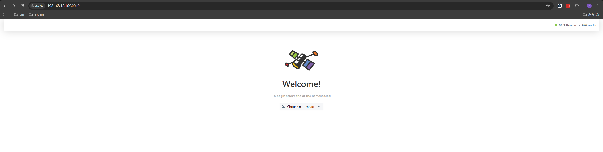

# Kubernetes 1.34高可用部署新招!中小企业如何打造容器运行时与网络插件的梦幻组合?

## 前言
Kubernetes作为容器编排的扛把子，在容器编排领域一直处于领先地位，但是中小企业在部署Kubernetes时，往往面临着容器运行时与网络插件选择困难的问题。本文将为大家介绍一些中小企业在选择容器运行时与网络插件时的考虑因素，以及一些推荐的组合。
## 背景
中小企业在选择容器运行时与网络插件时，往往面临着选择困难的问题。本文将为大家介绍一些中小企业在选择容器运行时与网络插件时的考虑因素，以及一些推荐的组合。
## 技术选型与推荐方案

### 1. 容器运行时:为什么选择 containerd?

在 Kubernetes 1.34 版本中,容器运行时的选择至关重要。传统的 Docker 作为容器运行时已经逐渐退出历史舞台,而 **containerd** 成为了最佳选择:

**为什么不再用 Docker?**
- Kubernetes 1.20+ 版本已弃用 dockershim
- Docker 架构层次过多,增加了不必要的开销
- 直接使用 CRI 运行时性能更优

**containerd 的优势:**
- ✅ 轻量级:相比 Docker,资源占用更少
- ✅ 高性能:直接实现 CRI 接口,减少调用链路
- ✅ 稳定可靠:CNCF 毕业项目,生产环境久经考验
- ✅ 原生支持:Kubernetes 官方推荐的容器运行时
- ✅ 易于维护:架构简洁,故障排查更便捷

### 2. 网络插件:为什么选择 Cilium?

网络插件是 Kubernetes 集群网络通信的核心,**Cilium** 是中小企业的最佳选择:

**Cilium 的核心优势:**
- ✅ 基于 eBPF:内核级性能优化,网络延迟更低
- ✅ 安全性强:提供 L3/L4/L7 层网络策略,支持零信任网络
- ✅ 可观测性:内置网络流量监控和追踪能力
- ✅ 服务网格:支持 Kubernetes Service Mesh,无需额外组件
- ✅ 性能卓越:相比传统 iptables 方案,性能提升显著
- ✅ 云原生:CNCF 项目,社区活跃,持续演进

**对比传统网络插件(如 Flannel、Calico):**
- Flannel:功能单一,仅提供基础网络
- Calico:依赖 iptables,大规模集群性能瓶颈明显
- Cilium:eBPF 加持,性能与功能兼得


### 推荐组合总结

| 组件类型 | 推荐方案 | 核心优势 |
|---------|---------|----------|
| 容器运行时 | **containerd** | 轻量、高性能、Kubernetes 原生支持 |
| 网络插件 | **Cilium** | eBPF 加持、安全可观测、服务网格 |

## 部署步骤
### 1. 主机清单
| 主机名 | IP | 角色 | 操作系统 |
| --- | --- | --- | --- |
| k8s-master1 | 192.168.18.10 | Master | Rocky Linux 10 |
| k8s-master2 | 192.168.18.20 | Master | Rocky Linux 10 |
| k8s-master3 | 192.168.18.30 | Master | Rocky Linux 10 |
| k8s-worker1 | 192.168.18.40 | Worker | Rocky Linux 10 |
| k8s-worker2 | 192.168.18.50 | Worker | Rocky Linux 10 |
| k8s-worker3 | 192.168.18.60 | Worker | Rocky Linux 10 |
### 2. 配置主机环境
   
kubernetes集群的所有主机都需要执行以下操作：

```bash
# 配置主机名映射
cat <<EOF >> /etc/hosts
192.168.18.10 k8s-master1 master1
192.168.18.20 k8s-master2 master2
192.168.18.30 k8s-master3 master3
192.168.18.40 k8s-worker1 worker1
192.168.18.50 k8s-worker2 worker2
192.168.18.60 k8s-worker3 worker3
192.168.18.70 k8s-vip
EOF

# 关闭防火墙
systemctl stop firewalld && systemctl disable firewalld
# 关闭selinux
sudo setenforce 0
sudo sed -i 's/^SELINUX=enforcing$/SELINUX=permissive/' /etc/selinux/config
# 关闭swap
swapoff -a
sed -i 's/.*swap.*/#&/' /etc/fstab
# 加载br_netfilter模块
sudo modprobe br_netfilter
cat <<EOF | sudo tee /etc/modules-load.d/k8s.conf
br_netfilter
EOF
# 配置sysctl参数
cat <<EOF | sudo tee /etc/sysctl.d/k8s.conf
net.bridge.bridge-nf-call-ip6tables = 1
net.bridge.bridge-nf-call-iptables = 1
net.ipv4.ip_forward=1
EOF
# 配置安全限制
cat >/etc/security/limits.conf <<EOF
* soft as unlimited
* hard as unlimited
* soft core unlimited
* hard core unlimited
* soft memlock unlimited
* hard memlock unlimited
* soft nofile 65535
* hard nofile 65535
* soft nproc 65535
* hard nproc 65535
EOF

ulimit -SHn 65535

# 配置sysctl参数
cat >/etc/sysctl.conf <<EOF
kernel.sysrq=0
net.ipv4.conf.all.send_redirects=0
net.ipv4.conf.default.send_redirects=0
net.ipv4.conf.all.accept_source_route=0
net.ipv4.conf.default.accept_source_route=0
net.ipv4.conf.all.accept_redirects=0
net.ipv4.conf.default.accept_redirects=0
net.ipv4.conf.all.secure_redirects=0
net.ipv4.conf.default.secure_redirects=0
net.ipv4.icmp_echo_ignore_broadcasts=1
net.ipv4.icmp_ignore_bogus_error_responses=1
net.ipv4.tcp_syncookies=1
kernel.dmesg_restrict=1
net.ipv6.conf.all.accept_redirects=0
net.ipv6.conf.default.accept_redirects=0

kernel.core_uses_pid=1
kernel.pid_max=4194303
kernel.shmall=3774873
kernel.shmmax=15461882265
kernel.msgmnb=65535
kernel.msgmax=65535
net.ipv4.ip_forward=1
net.ipv4.tcp_tw_reuse=1
net.ipv4.tcp_timestamps=1
net.ipv4.tcp_fin_timeout=30
net.ipv4.tcp_max_tw_buckets=50000
net.ipv4.tcp_max_syn_backlog=65535
net.ipv4.conf.all.rp_filter=0
net.ipv4.conf.default.rp_filter=0
net.ipv4.ip_local_port_range=1024 65535
net.ipv4.ip_local_reserved_ports=8080,8088
net.ipv6.conf.all.disable_ipv6=0
net.ipv6.conf.default.disable_ipv6=0
net.ipv6.conf.lo.disable_ipv6=0
vm.overcommit_memory=1
vm.swappiness=0
vm.max_map_count=1048575
net.core.netdev_max_backlog=32768
net.core.somaxconn = 32768
net.ipv4.icmp_echo_ignore_all=0
net.ipv4.tcp_abort_on_overflow=0
fs.inotify.max_user_instances=8192
fs.inotify.max_user_watches=524288
net.bridge.bridge-nf-call-arptables=1
net.bridge.bridge-nf-call-ip6tables=1
net.bridge.bridge-nf-call-iptables=1
net.netfilter.nf_conntrack_max=2310720

fs.file-max=6553500
fs.nr_open=6553500
EOF
# 使sysctl参数生效
sudo sysctl --system
```

### 3. 安装 containerd

containerd 是一个高性能的容器运行时，支持容器标准接口，是 Kubernetes 推荐的容器运行时之一。
```bash
wget https://github.com/containerd/containerd/releases/download/v2.2.0/containerd-2.2.0-linux-amd64.tar.gz
tar -C /usr/local -xzf containerd-2.2.0-linux-amd64.tar.gz
# 配置containerd service
wget https://raw.githubusercontent.com/containerd/containerd/main/containerd.service
mv containerd.service /etc/systemd/system/
sudo cat <<EOF | sudo tee /etc/crictl.yaml
runtime-endpoint: unix:///run/containerd/containerd.sock
image-endpoint: unix:///run/containerd/containerd.sock
timeout: 10
debug: false
EOF
sed -i 's/infinity/65535/g' /etc/systemd/system/containerd.service 
systemctl daemon-reload
systemctl start containerd
systemctl enable containerd
```

### 4. 安装runc
runc 是 containerd 的默认运行时，用于创建和管理容器。
```bash
wget https://github.com/opencontainers/runc/releases/download/v1.4.0-rc.3/runc.amd64
install -m 755 runc.amd64 /usr/local/sbin/runc
```
### 5. 安装kubeadm，kubelet，kubectl
kubeadm 是 Kubernetes 的初始化工具，kubelet 是 Kubernetes 的节点代理，kubectl 是 Kubernetes 的命令行工具。
因为我的系统是`rocky linux`需要`dnf`的方式来安装
```bash
cat <<EOF | sudo tee /etc/yum.repos.d/kubernetes.repo
[kubernetes]
name=Kubernetes
baseurl=https://pkgs.k8s.io/core:/stable:/v1.34/rpm/
enabled=1
gpgcheck=1
gpgkey=https://pkgs.k8s.io/core:/stable:/v1.34/rpm/repodata/repomd.xml.key
EOF
dnf -y install kubeadm kubelet kubectl
```
## 高可用组件部署，以下命令在三个master节点上执行
### 1. 安装keepalived
keepalived 是一个高可用解决方案，用于实现主从切换。
```bash
dnf -y install keepalived
#!/bin/bash

source /etc/profile
# Config keepalive
yum install -y keepalived
sudo cat <<EOF | sudo tee /etc/keepalived/keepalived.conf
global_defs {
    router_id LVS_DEVEL
}
vrrp_script check_apiserver {
  script "/etc/keepalived/check_apiserver.sh"
  interval 3
  weight -2
  fall 10
  rise 2
}

vrrp_instance VI_1 {
    state MASTER
    interface ens160 # 网卡名
    virtual_router_id 52
    priority 100
    authentication {
        auth_type PASS
        auth_pass 42
    }
    virtual_ipaddress {
        192.168.18.70 # VIP地址
    }
    track_script {
        check_apiserver
    }
}
EOF

sudo cat <<EOF | sudo tee /etc/keepalived/check_apiserver.sh
#!/bin/sh

errorExit() {
    echo "*** $*" 1>&2
    exit 1
}

curl --silent --max-time 2 --insecure https://localhost:7443/ -o /dev/null || errorExit "Error GET https://localhost:7443/"
if ip addr | grep -q 192.168.18.70; then
    curl --silent --max-time 2 --insecure https://192.168.18.70:7443/ -o /dev/null || errorExit "Error GET https://192.168.18.70:7443/"
fi
EOF

systemctl start keepalived
systemctl enable keepalived

```
***需要注意priority 100在三个master节点不要设置一样，可以设置为90,100,110，否则会出现脑裂的情况！***

### 2. 安装HAProxy
HAProxy 是一个高性能的负载均衡器，用于实现负载均衡。
```bash
dnf -y install haproxy
sudo cat <<EOF | sudo tee /etc/haproxy/haproxy.cfg
# /etc/haproxy/haproxy.cfg
#---------------------------------------------------------------------
# Global settings
#---------------------------------------------------------------------
global
    log /dev/log local0
    log /dev/log local1 notice
    daemon

#---------------------------------------------------------------------
# common defaults that all the 'listen' and 'backend' sections will
# use if not designated in their block
#---------------------------------------------------------------------
defaults
    mode                    http
    log                     global
    option                  httplog
    option                  dontlognull
    option http-server-close
    option forwardfor       except 127.0.0.0/8
    option                  redispatch
    retries                 1
    timeout http-request    10s
    timeout queue           20s
    timeout connect         5s
    timeout client          20s
    timeout server          20s
    timeout http-keep-alive 10s
    timeout check           10s

#---------------------------------------------------------------------
# apiserver frontend which proxys to the control plane nodes
#---------------------------------------------------------------------
frontend apiserver
    bind *:7443
    mode tcp
    option tcplog
    default_backend apiserver

#---------------------------------------------------------------------
# round robin balancing for apiserver
#---------------------------------------------------------------------
backend apiserver
    option httpchk GET /healthz
    http-check expect status 200
    mode tcp
    option ssl-hello-chk
    balance     roundrobin
        server master1 192.168.18.10:6443 check
        server master2 192.168.18.20:6443 check
        server master3 192.168.18.30:6443 check
EOF
systemctl enable haproxy --now
```
***可能会出现以下内容，不要惊慌，这是正常现象，因为haproxy的后端代理还没有启动,下面我们将kubernetes的apiserver启动就会解决。***
```
Broadcast message from systemd-journald@master1 (Wed 2025-11-12 19:12:43 CST):

haproxy[5581]: backend apiserver has no server available!


Broadcast message from systemd-journald@master1 (Wed 2025-11-12 19:12:43 CST):

haproxy[5581]: backend apiserver has no server available!

```
## 使用VIP和HAProxy代理的端口初始化kubernetes集群
### 1. 初始化kubernetes集群，在master1节点执行
***注意： 我们使用外部etcd集群来初始化kubernetes集群，如果没有etcd集群请把etcd相关参数删除，想要了解如何搭建etcd集群，请看[搭建etcd集群](https://mp.weixin.qq.com/s/gK-ELGdqp2x_FDELGUlsGg)***
```bash
cat <<EOF > kubeadm-config-external-etcd.yaml
apiVersion: kubeadm.k8s.io/v1beta4
bootstrapTokens:
- groups:
  - system:bootstrappers:kubeadm:default-node-token
  token: abcdef.0123456789abcdef
  ttl: 24h0m0s
  usages:
  - signing
  - authentication
kind: InitConfiguration
localAPIEndpoint:
  advertiseAddress: 192.168.18.10
  bindPort: 6443
nodeRegistration:
  criSocket: unix:///var/run/containerd/containerd.sock
  imagePullPolicy: IfNotPresent
  imagePullSerial: true
  name: master1
  taints: null
timeouts:
  controlPlaneComponentHealthCheck: 4m0s
  discovery: 5m0s
  etcdAPICall: 2m0s
  kubeletHealthCheck: 4m0s
  kubernetesAPICall: 1m0s
  tlsBootstrap: 5m0s
  upgradeManifests: 5m0s
---
apiServer: {}
apiVersion: kubeadm.k8s.io/v1beta4
caCertificateValidityPeriod: 87600h0m0s
certificateValidityPeriod: 8760h0m0s
certificatesDir: /etc/kubernetes/pki
clusterName: kubernetes
controlPlaneEndpoint: "192.168.18.70:7443"
controllerManager: {}
dns: {}
encryptionAlgorithm: RSA-2048
etcd:
  external:
    endpoints:
      - "https://192.168.18.10:2379"
      - "https://192.168.18.20:2379"
      - "https://192.168.18.30:2379"
    caFile: "/etc/etcd/pki/ca.pem"
    certFile: "/etc/etcd/pki/etcd-client.pem"
    keyFile: "/etc/etcd/pki/etcd-client-key.pem"
imageRepository: registry.k8s.io
kind: ClusterConfiguration
kubernetesVersion: 1.34.0
networking:
  dnsDomain: cluster.local
  podSubnet: 10.244.0.0/16
  serviceSubnet: 10.96.0.0/12
proxy: {}
scheduler: {}
EOF
kubeadm init --config=kubeadm-config-external-etcd.yaml
```
***注意： 初始化完成后，请务必查看输出结果，特别是关于kubectl配置和节点加入的提示，下面是示例输出：***
```
Your Kubernetes control-plane has initialized successfully!

To start using your cluster, you need to run the following as a regular user:

  mkdir -p $HOME/.kube
  sudo cp -i /etc/kubernetes/admin.conf $HOME/.kube/config
  sudo chown $(id -u):$(id -g) $HOME/.kube/config

Alternatively, if you are the root user, you can run:

  export KUBECONFIG=/etc/kubernetes/admin.conf

You should now deploy a pod network to the cluster.
Run "kubectl apply -f [podnetwork].yaml" with one of the options listed at:
  https://kubernetes.io/docs/concepts/cluster-administration/addons/

You can now join any number of control-plane nodes running the following command on each as root:

  kubeadm join 192.168.18.70:7443 --token abcdef.0123456789abcdef \
	--discovery-token-ca-cert-hash sha256:ae9ef1ba957fcb5cf6dc0403163ae52c03b69d488d9447f6bf99dd8d8ecd7b17 \
	--control-plane --certificate-key 27287c78900890ccb52e2e617646b488475dcf2098c6500b860ae6057aedd392

Please note that the certificate-key gives access to cluster sensitive data, keep it secret!
As a safeguard, uploaded-certs will be deleted in two hours; If necessary, you can use
"kubeadm init phase upload-certs --upload-certs" to reload certs afterward.

Then you can join any number of worker nodes by running the following on each as root:

kubeadm join 192.168.18.70:7443 --token abcdef.0123456789abcdef \
	--discovery-token-ca-cert-hash sha256:ae9ef1ba957fcb5cf6dc0403163ae52c03b69d488d9447f6bf99dd8d8ecd7b17
```


### 2. 配置kubectl访问集群(在master1节点执行)

**重要:必须执行以下命令,否则无法使用kubectl与Kubernetes集群进行交互!**

```bash
mkdir -p $HOME/.kube
sudo cp -i /etc/kubernetes/admin.conf $HOME/.kube/config
sudo chown $(id -u):$(id -g) $HOME/.kube/config
```

执行完成后,验证kubectl是否可用:
```bash
kubectl get nodes
```

### 3. 其他Master节点加入集群(在master2和master3节点执行)

**在master2和master3节点上执行以下命令(带`--control-plane`参数):**

```bash
kubeadm join 192.168.18.70:7443 --token abcdef.0123456789abcdef \
  --discovery-token-ca-cert-hash sha256:ae9ef1ba957fcb5cf6dc0403163ae52c03b69d488d9447f6bf99dd8d8ecd7b17 \
  --control-plane --certificate-key 27287c78900890ccb52e2e617646b488475dcf2098c6500b860ae6057aedd392
```

**注意:**
- `--control-plane` 参数表示该节点作为控制平面节点加入
- `--certificate-key` 是init输出中提供的值，用于自动下载集群证书，有效期2小时
- 加入后，这些节点也需要配置kubectl（执行上面的kubectl配置命令）

### 4. Worker节点加入集群(在worker1、worker2、worker3节点执行)

**在所有Worker节点上执行以下命令(不带`--control-plane`参数):**

```bash
kubeadm join 192.168.18.70:7443 --token abcdef.0123456789abcdef \
  --discovery-token-ca-cert-hash sha256:ae9ef1ba957fcb5cf6dc0403163ae52c03b69d488d9447f6bf99dd8d8ecd7b17
```

### 5. Token过期后如何加入节点?

**问题:**kubeadm生成的token默认有效期为24小时,过期后无法使用原命令加入节点。

**解决方案:**

#### 5.1 重新生成token和证书hash(在任意master节点执行)

```bash
# 生成新的token
kubeadm token create

# 获取CA证书hash值
openssl x509 -pubkey -in /etc/kubernetes/pki/ca.crt | openssl rsa -pubin -outform der 2>/dev/null | openssl dgst -sha256 -hex | sed 's/^.* //'

# 或者使用以下命令一步生成完整的join命令
kubeadm token create --print-join-command
```

#### 5.2 Master节点加入(需要额外参数)

**方法一:使用certificate-key(推荐)**

```bash
# 在已有master节点上生成certificate-key并上传证书
kubeadm init phase upload-certs --upload-certs

# 会输出类似如下内容,记录certificate-key值
# [upload-certs] Storing the certificates in Secret "kubeadm-certs" in the "kube-system" Namespace
# [upload-certs] Using certificate key:
# abc123def456...  # 这就是certificate-key

# 生成完整的master加入命令
kubeadm token create --print-join-command --certificate-key <certificate-key>

# 在新master节点上执行:
kubeadm join 192.168.18.70:7443 --token <new-token> \
  --discovery-token-ca-cert-hash sha256:<hash> \
  --control-plane \
  --certificate-key <certificate-key>
```

**方法二:手动复制证书(不推荐)**

```bash
# 在已有master节点上,手动复制证书到新master节点
# 需要复制/etc/kubernetes/pki/目录下的相关证书文件

# 然后在新master节点执行:
kubeadm join 192.168.18.70:7443 --token <new-token> \
  --discovery-token-ca-cert-hash sha256:<hash> \
  --control-plane
```

#### 5.3 Worker节点加入(简单)

```bash
# 直接使用新token和hash值
kubeadm join 192.168.18.70:7443 --token <new-token> \
  --discovery-token-ca-cert-hash sha256:<hash>
```

**小贴士:**
- 使用 `kubeadm token list` 查看当前token列表和有效期
- 使用 `kubeadm token delete <token>` 删除过期token
- certificate-key 的有效期为2小时,过期后需重新生成

### 6. 验证集群
```
[root@master1 ~]# kubectl get node 
NAME      STATUS     ROLES           AGE    VERSION
master1   NotReady   control-plane   12h    v1.34.2
master2   NotReady   control-plane   103s   v1.34.2
master3   NotReady   control-plane   45s    v1.34.2
worker1   NotReady   <none>          16s    v1.34.2
worker2   NotReady   <none>          11s    v1.34.2
worker3   NotReady   <none>          6s     v1.34.2
```
可以看到当前所有节点的状态都是notready的状态，这是因为没有部署网络插件，下面开始部署。

### 7. 部署cilium网络插件
cilium是一个高性能的网络插件，支持网络策略、网络地址转换等功能，适合用于生产环境。
```bash
## 首先安装helm
[root@master1 ~]# wget https://get.helm.sh/helm-v4.0.0-linux-amd64.tar.gz
[root@master1 ~]# tar -zxvf helm-v4.0.0-linux-amd64.tar.gz
[root@master1 ~]# mv linux-amd64/helm /usr/local/bin/
## 添加cilium仓库
helm repo add cilium https://helm.cilium.io
helm repo update
helm install cilium cilium/cilium --namespace kube-system \
  --set k8sServiceHost=auto \
  --set ipam.mode="cluster-pool" \
  --set k8s.requireIPv4PodCIDR=true \
  --set ipv4NativeRoutingCIDR=10.244.0.0/16 \
  --set routingMode=native \
  --set autoDirectNodeRoutes=true \
  --set endpointRoutes.enabled=true \
  --set kubeProxyReplacement=true \
  --set bpf.masquerade=true \
  --set installNoConntrackIptablesRules=true \
  --set hubble.enabled=true \
  --set hubble.relay.enabled=true \
  --set hubble.ui.enabled=true \
  --set hubble.ui.service.type=NodePort \
  --set hubble.ui.service.nodePort=30010 \
  --set prometheus.enabled=true \
  --set operator.prometheus.enabled=true
```
看到以下内容就代表您的cilium已部署成功:
```
[root@master1 ~]# kubectl get pod -n kube-system 
NAME                               READY   STATUS    RESTARTS      AGE
cilium-5r8z7                       1/1     Running   0             2m
cilium-8zfjm                       1/1     Running   0             2m
cilium-9cl8n                       1/1     Running   0             2m
cilium-cf86j                       1/1     Running   0             2m
cilium-envoy-95nl7                 1/1     Running   0             2m
cilium-envoy-l27pn                 1/1     Running   0             2m
cilium-envoy-pcgjg                 1/1     Running   0             2m
cilium-envoy-ss9hc                 1/1     Running   0             2m
cilium-envoy-t5r77                 1/1     Running   0             2m
cilium-envoy-wkgvv                 1/1     Running   0             2m
cilium-lk26f                       1/1     Running   0             2m
cilium-operator-7654bcff5f-jgxb5   1/1     Running   0             2m
cilium-operator-7654bcff5f-vtkj2   1/1     Running   1 (69s ago)   2m
cilium-vk2jr                       1/1     Running   0             2m
coredns-66bc5c9577-8vb8d           1/1     Running   0             12h
coredns-66bc5c9577-jsz7v           1/1     Running   0             12h
hubble-relay-86b5fc8778-6n2n5      1/1     Running   0             2m
hubble-ui-576dcd986f-gvjf6         2/2     Running   0             2m
kube-apiserver-master1             1/1     Running   1             12h
kube-apiserver-master2             1/1     Running   0             11m
kube-apiserver-master3             1/1     Running   0             10m
kube-controller-manager-master1    1/1     Running   2 (79s ago)   12h
kube-controller-manager-master2    1/1     Running   0             11m
kube-controller-manager-master3    1/1     Running   0             10m
kube-proxy-2q7bb                   1/1     Running   0             11m
kube-proxy-btwdh                   1/1     Running   0             10m
kube-proxy-bxzmx                   1/1     Running   0             10m
kube-proxy-cwltl                   1/1     Running   0             10m
kube-proxy-mxwwb                   1/1     Running   1             12h
kube-proxy-qrfzt                   1/1     Running   0             10m
kube-scheduler-master1             1/1     Running   2 (83s ago)   12h
kube-scheduler-master2             1/1     Running   0             11m
kube-scheduler-master3             1/1     Running   0             10m
[root@master1 ~]# kubectl get svc -n kube-system 
NAME           TYPE        CLUSTER-IP       EXTERNAL-IP   PORT(S)                  AGE
cilium-envoy   ClusterIP   None             <none>        9964/TCP                 2m2s
hubble-peer    ClusterIP   10.104.92.175    <none>        443/TCP                  2m2s
hubble-relay   ClusterIP   10.108.254.165   <none>        80/TCP                   2m2s
hubble-ui      NodePort    10.103.57.135    <none>        80:30010/TCP             2m2s
kube-dns       ClusterIP   10.96.0.10       <none>        53/UDP,53/TCP,9153/TCP   12h

```
接下来我们访问http://192.168.18.10:30010（想要使用vip访问的话，需要将kube-proxy重启）查看服务间的网络调用：


## 结语
恐！从技术选型到实际部署，我们一步步完成了 Kubernetes 1.34 高可用集群的搭建。回顾一下我们的收获：

**技术选型上**，我们选择了：
- ✅ **containerd** 作为容器运行时 - 轻量高效，Kubernetes 原生支持
- ✅ **Cilium** 作为网络插件 - eBPF 黑科技，性能与安全升级

**架构设计上**，我们实现了：
- ✅ 3个Master节点 + 3个Worker节点的高可用架构
- ✅ Keepalived + HAProxy 实现VIP漂移和负载均衡
- ✅ 外部etcd集群，数据存储更安全

**部署流程上**，我们掌握了：
- ✅ 系统环境优化配置
- ✅ containerd + runc 安装与配置
- ✅ kubeadm 初始化集群的最佳实践
- ✅ 节点加入与 token 管理技巧
- ✅ Cilium 网络插件的完整部署，开启Hubble可观测性

### 下一步：让集群更强大

现在集群已经可以正常运行，但还可以继续优化：
1. **配置持久化存储** - 部署StorageClass，为应用提供数据持久化
2. **部署监控系统** - victoriametrics + Grafana 全方位监控集群状态
3. **配置日志集中化** - victorlogs 日志收集分析
4. **安全策略加固** - NetworkPolicy、PodSecurityPolicy 等

这些进阶话题，我们后续会逐一分享，敬请期待！

### 写在最后

Kubernetes 的世界博大精深，从入门到精通需要不断实践和积累。希望这篇文章能为你的 K8s 之路点亮一盏明灯。

如果你在部署过程中遇到问题，欢迎在评论区留言讨论，或者加入我们的技术交流群一起探讨。别忘了**点赞**、**在看**、**分享**三连，让更多的小伙伴看到这篇干货！

---

**关注我，持续分享**：
- 💻 Kubernetes 实战经验
- 🔧 云原生技术栈
- 🚀 DevOps 最佳实践

下期预告：**《Kubernetes存储与监控实战：Rook-Ceph + VictoriaMetrics完整部署指南》**